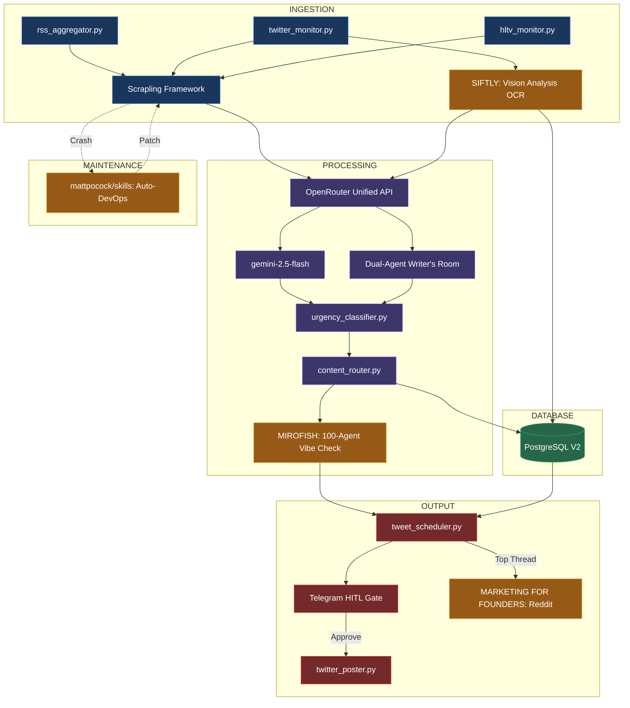

# SkinBetHub — CS2 Twitter Bot: V2 Pipeline

> Autonomous CS2 Esports Media Engine
> Standalone Project — "The HLTV Regular Who Reads Bloomberg"
> Last updated: March 27, 2026
> **Status: LIVE — 7/7 PM2 processes online | First tweet POSTED | Growth Target: 54 → 1,000 followers in 30 days**

---

## 🟢 LIVE SYSTEM STATE (March 27, 2026)

| Component | Status | Detail |
|-----------|--------|--------|
| PM2 Processes | ✅ 7/7 online | `siftly_ingestor`, `scrapling_pool`, `tweet_scheduler`, `vip_hitl_bot`, `twitter_poster`, `engagement_tracker`, `follower_growth` |
| X API v2 Posting | ✅ **LIVE** | App `UbuntuOpenclaw` attached to Project `HubSkin80817` (Pay Per Use). First tweet posted 2026-03-27. |
| ClawRouter | ✅ Running | `http://localhost:8402/v1` — 147 models, systemd user service |
| Railway PostgreSQL | ✅ Connected | 13 tables (incl. `engagement_tracking`), 2 functions, 38+ indexes, 18 active VIP accounts |
| LLM ECO | ✅ Paid | `xai/grok-4-1-fast-non-reasoning` — Grok-4-1 Fast (classification, parsing) |
| LLM AUTO | ✅ Paid | `xai/grok-4-1-fast-reasoning` — Grok-4-1 Fast Reasoning (tweet writing, personality) |
| LLM PREMIUM | ✅ Paid | `anthropic/claude-sonnet-4.6` — Claude Sonnet 4.6 (guardrails, RLHF, MiroFish) |
| RSS Ingestion | ✅ CS2-only | 3 feeds via `curl_cffi` TLS impersonation: HLTV ✅, Steam CS2 (Valve updates) ✅, Esports Insider ✅ |
| Valve CS2 Updates | ✅ **NEW** | `store.steampowered.com/feeds/news/app/730` — patch notes, game updates, operations. Auto-generates **threads** for major updates. |
| HLTV Monitor | ✅ Active | Match results (T1 events only: ESL, BLAST, IEM, PGL, Major, etc.) + news + community comment scraping |
| HLTV Vibe Engine | ✅ Active | Detects ~17 CS2 memes, crowd sentiment per team, top comment injection into LLM prompt |
| Twitter VIP Monitor | ✅ Active | 18 CS2 accounts via **GraphQL guest token** (20-tweet fetch, dedup, 2s stagger, auto-retry on >50% fail) |
| CS2 Content Filter | ✅ Active | Positive CS2 keywords + negative game filter (VALORANT, OW, LoL, Dota, etc.) on RSS + scheduler |
| Fact Checker | ✅ Active | LLM-based fact verification catches made-up stats and incorrect match scores before HITL |
| Event→Category | ✅ Active | LLM eco-tier reclassification of VIP tweets into proper categories (roster_change, match_result, etc.) |
| Event Dedup | ✅ Active | `source_url` unique index on `events` + in-memory `_seen_tweet_ids` set for VIP tweet dedup |
| **Auto-Approve** | ✅ **NEW** | High-confidence news (match_result, cs2_update, roster_change) from trusted sources skip HITL → straight to queue |
| **Media Attachments** | ✅ **NEW** | `media_manager.py` extracts images from Steam/Valve/HLTV articles, uploads via Tweepy v1.1 API |
| **Thread Generation** | ✅ **NEW** | Valve CS2 updates with >300 chars auto-generate 2-3 tweet threads (content_generator.generate_thread) |
| **Quote Tweets** | ✅ **NEW** | 25% of VIP engagements become quote tweets instead of replies (more visible, builds brand) |
| **Peak Hour Scheduling** | ✅ **NEW** | Non-urgent tweets deferred to 15:00-23:00 UTC (EU evening + NA afternoon = max eyeballs) |
| **Engagement Analytics** | ✅ **NEW** | `engagement_tracker.py` (PM2) fetches tweet metrics every 30 min, stores snapshots, auto-labels RLHF (top/good/mid) |
| **Post-Match Analyzer** | ✅ **NEW** | `match_analyzer.py` — deep T1 match analysis with upset detection, prediction tracking, and auto-threads for major results |
| Telegram HITL | ✅ Active | `@sbhtwitterbot` — shows media/thread/QT badges. Auto-approved news skips HITL. |
| Twitter Poster | ✅ Active | X API v2 posting via tweepy, supports single tweets, replies, quote tweets, threads, and media_ids |
| Reddit | 🚫 Disabled | `ENABLE_REDDIT_CROSSPOST=false` — violates Reddit Responsible Builder Policy |
| Env Backup | ✅ Synced | `/home/ubuntu/openclaw/config/.env.production` |
| Secrets | ✅ RAM-only | `/dev/shm/.env` — regenerated from backup on each reboot via cron |

---

# PART 1: THE VISION & PSYCHOLOGICAL PROFILE

> **"The account that never sleeps, never misses a CS2 match, and sounds like someone who read every HLTV thread."**

This is a fully autonomous CS2 esports media engine running 24/7. It curates CS2 news from HLTV, RSS feeds, and VIP accounts, drops hot takes with real community context, and engages with the CS2 Twitter scene. It is exclusively CS2-focused — no generic gaming, no betting spam, no poker.

The bot does not sell. It does not spam links. It builds authority by being the most plugged-in CS2 account on the timeline.

## The Persona
This is NOT a corporate regurgitator. This is a CS2 brain.
- **Voice:** Sharp, irreverent, HLTV-native. Never corporate. Never cringe-overexplaining.
- **Humor:** Dry. Knows EZ4ENCE, s1mple GOAT debate, Liquid major curse, cry is free — uses them when relevant, not forced.
- **Intelligence:** Knows H2H records, map stats, team form. Drops facts casually.
- **Community-Aware:** Reads HLTV comment sections on match pages to absorb community vibes, memes, and hot takes before generating tweets. Tweets feel like they came from someone who sat in the thread.
- **Speed:** First to post CS2 breaking news. If HLTV posts a roster change, this account tweets it within 60 seconds.

## The 6 Core Constraints (DO NOT VIOLATE)

1. **True IP Autonomy (4G/5G API-Controlled Mobile Proxies):** The system relies on rotating 4G/5G mobile proxies to mask its fingerprint as a real iPhone moving around a city. This eliminates the need for strict IP lockouts and enables simultaneous high-volume reading and writing to cover multiple live events at once.
2. **Strict API Cap (Basic Tier):** We are hard-capped at **40 tweets/replies per day** (X API v2 Basic). Every output must be extremely high-value. No filler.
3. **No Browser-Use for Posting:** Posting is **strictly via official X API v2**. While we use rotating 4G mobile proxies for ingestion, API posting is computationally cheaper, 100x faster, and has zero DOM-drift risk. Save the headless browsers entirely for the Scrapling ingestion layer.
4. **HITL Telegram Gate (Engagement VIPs):** The bot hunts VIP tweets and generates high-value replies. Before posting, the generated reply is routed to a Telegram bot. A human must click `[Approve]`, `[Reject]`, or `[Regenerate]`.
5. **Auto-RLHF (Self-Correction with Drift Ceiling):** Every Sunday, a cron job pulls the Top 5 and Bottom 5 performing tweets of the week. It feeds them back into the LLM system prompt to autonomously refine its tone and avoid repeating flops.
   * **Drift Ceiling:** The system prompt is split into a **frozen base prompt** (persona, voice, constraints — NEVER modified) and a **tunable appendix** (max 200 tokens, RLHF-modified weekly). Before applying any RLHF update, a cosine similarity check compares the new appendix embedding vs. the original appendix. If similarity drops below 0.70, the update is rejected, a Telegram alert is sent, and the previous appendix is retained. This prevents persona decay over months of autonomous mutation.
6. **ClawRouter Local Gateway (LLM Routing):** All LLM calls route through a local **ClawRouter** instance running on `http://localhost:8402/v1` — an OpenAI-compatible proxy that aggregates 147+ free and paid models. The bot uses the OpenAI SDK pointed at `localhost:8402`. ClawRouter runs as a systemd user service (`openclaw-gateway.service`) with autostart via `loginctl enable-linger ubuntu`.

   **Live Model Tiers (as of March 26, 2026):**
   | Tier | Env Var | Model | Cost | Jobs |
   |------|---------|-------|------|------|
   | ECO | `LLM_TIER_ECO` | `xai/grok-4-1-fast-non-reasoning` | Paid | RSS classification, urgency detection, dedup, persona selection |
   | AUTO | `LLM_TIER_AUTO` | `xai/grok-4-1-fast-reasoning` | Paid | Tweet writing (Writer agent + Editor agent), VIP replies, thread composition |
   | PREMIUM | `LLM_TIER_PREMIUM` | `anthropic/claude-sonnet-4.6` | Paid | MiroFish vibe-check, RLHF analysis, tone validation fallback |

   **Why these choices:**
   - **ECO → `xai/grok-4-1-fast-non-reasoning`:** Grok-4-1 Fast (non-reasoning) for classification and urgency detection — fast, reliable, no chain-of-thought overhead.
   - **AUTO → `xai/grok-4-1-fast-reasoning`:** Grok-4-1 Fast with reasoning for personality-driven writing — handles CS2 banter, dry wit, and HLTV energy.
   - **PREMIUM → `anthropic/claude-sonnet-4.6`:** Claude Sonnet 4.6 for MiroFish nuanced “will this get reported?” judgment, RLHF pattern analysis, and tone validation fallback.

   **Why ClawRouter over direct OpenRouter?**
   - ECO and AUTO tiers run entirely free — NVIDIA/DeepSeek free-tier models via ClawRouter's aggregation
   - EVM wallet: `0x342037783367Ff9db74C7aF39207D4295a7cA7E1` (fund with USDC on Base to unlock PREMIUM tier)
   - 147 models available without managing multiple API keys
   - If ClawRouter crashes: `systemctl --user restart openclaw-gateway.service`

   **TIER ALIGNMENT:** `OPENROUTER_BASE_URL=http://localhost:8402/v1` — the OpenAI SDK is routed to ClawRouter, which proxies to the actual model providers.

---

# PART 2: THE 4 NEW REPOSITORY INTEGRATIONS

The V2 architecture introduces four cutting-edge open-source repositories to transform the bot from a text poster into an autonomous omnichannel media agency.

> **Database Note:** The Twitter Bot connects to a **Railway-hosted PostgreSQL 16** instance (external managed DB, not local). Both SkinBetAI (`signal_map` schema) and Twitter Bot (`twitter_bot` schema) share the same Railway PostgreSQL instance over TLS. Cross-schema references from the SkinBetAI prediction engine (e.g., Factor #33 → `twitter_bot.hitl_engaged_7d`) use explicit schema-qualified names. Connection string: `DATABASE_URL` env var (Railway provides `postgresql://...railway.app:5432/...`). Expected latency overhead vs local socket: ~5-15ms per query (negligible for our workload).
>
> **🔒 Database Security (MANDATORY):**
> - **IP Allowlist:** Railway Private Networking or TCP Proxy restricted to Hetzner VPS static IP only. No public internet access to the database.
> - **TLS:** `sslmode=verify-full` enforced in all connection strings.
> - **Separate DB users:** `twitterbot_rw` (read-write `twitter_bot` schema only), `skinbetai_rw` (read-write `signal_map` only), `analytics_ro` (read-only both schemas for reporting). The Twitter Bot CANNOT write to the `signal_map` schema and vice versa.
> - **pgaudit:** Extension enabled — logs all DDL + DML on `tweets_v2`, `api_quotas`, and `hitl_engaged_7d` tables. Shipped to Airflow alerting DAG.
> - **Secrets:** `DATABASE_URL` stored in `sops`-encrypted `.env` file. NEVER logged to stdout, PM2 logs, or Telegram debug messages. See Security section.

### 1. Siftly (God-Mode Ingestion)
Replaces the basic semantic dedup engine. Siftly runs Vision Analysis (OCR on charts, reading memes) and Semantic Tagging on incoming tweets, storing results in PostgreSQL (see Part 9 — SQLite was removed to eliminate split-brain issues). The bot can now "read" images attached to VIP tweets and reply with hyper-contextual takes based on the visual data.
*   **Implementation Detail:** Siftly runs as a background daemon parsing all incoming tweet JSONs that contain `media_urls`. If it detects a meme format using its internal ResNet embeddings, it flags it for Pillar 5 meme-jacking.

### 2. MiroFish (Swarm Vibe-Check)
Acts as a pre-tweet guardrail for high-risk content (Pillar 3: Hot Takes / Pillar 7: Drama). Before posting an edgy tweet, it is fed into an air-gapped MiroFish sandbox with **100 simulated agents** (scaled down from 1,000 — 100 agents provide 95% of consensus signal at 10% of the compute cost and sub-3s latency, making it viable for real-time tweet guardrails. Reserve full 1,000-agent sims for weekly content strategy deep-dives).
*   **Implementation Detail:** MiroFish simulates 100 distinct personas (e.g., "angry esports fan", "compliance lawyer", "rival brand CEO"). The simulation runs for 4 ticks. If >20% of the nodes simulate reporting the tweet, the raw report rate is converted to a normalized `ratio_risk_score` (0.0–1.0) using a sigmoid scaling function. A 20% raw report rate maps to a `ratio_risk_score` of ~0.75, which is the veto threshold in `mirofish_guard.py`. Anything above 0.75 triggers an abort.
*   **Threshold Mapping:** `ratio_risk_score = sigmoid((report_pct - 0.10) * 15)`. At 10% reports → score ~0.50 (warn). At 20% reports → score ~0.75 (veto). At 30%+ reports → score ~0.95 (hard block + Telegram alert).
*   **⚠️ AGPL LICENSE:** MiroFish is AGPL-licensed. Air-gapping does NOT satisfy AGPL copyleft — if MiroFish runs as a component of a networked service, source disclosure obligations still apply. **Recommended path:** replace with a permissively-licensed alternative (Mesa, Apache 2.0) or a custom lightweight LLM-debate framework. Only use MiroFish directly if legal counsel confirms compliance. Consult legal counsel before shipping commercially.

### 3. ~~Marketing-for-Founders (Reddit Cross-Pollination)~~ — **DISABLED**
⚠️ **Reddit cross-posting is permanently disabled.** Reddit's Responsible Builder Policy prohibits: (a) automated cross-posting between platforms, and (b) commercial use of Reddit's platform without written approval. `ENABLE_REDDIT_CROSSPOST=false` in `.env`. Reddit credentials are commented out. `reddit_cross_poster.py` exists but is never called.

*If Reddit is needed in future:* Apply for Reddit's [Data API commercial license](https://www.redditinc.com/policies/data-api-terms) and rewrite as a manual-curation flow, not automated cross-posting.

### 4. HLTV Community Vibe Engine (New — March 26, 2026)
After scraping a match result, `hltv_monitor.py` visits the match page and pulls community comments. It runs `extract_community_vibe()` which detects ~17 CS2 community memes (EZ4ENCE, cry is free, s1mple GOAT, Liquid curse, etc.), measures per-team crowd sentiment (hyped/doubted/neutral), and saves the top punchy comment. This `community_vibe` JSONB blob is stored in `events.metadata` and injected into the content generator's prompt as `HLTV COMMUNITY VIBE:` context — so tweets feel like they come from someone who sat in the match thread.

### 5. mattpocock/skills (Auto-DevOps)
A self-healing maintenance layer driven by Claude Code. If X or HLTV changes their DOM structure and `scrapling` throws an error, a local agent uses the `triage-issue` and `tdd` skills to read the stack trace, rewrite the scraper CSS selector, test it, and patch the code — entirely without human intervention.
*   **Implementation Detail:** The system recognizes `TimeoutError` or `ElementNotFound` from Scrapling's `page.locator()`. It passes the raw HTML DOM string of the failed page into Claude Code alongside the failing python script.
*   **⚠️ SECURITY GATE:** Auto-patched code is committed to a `fix/auto-patch-*` branch, NOT directly to main. A **three-layer security gate** validates the patch:
    1. **Static analysis:** Bandit + Semgrep run on the diff.
    2. **Sandbox execution:** Patched scraper runs in a Docker container with network egress restricted to an allowlist (only target domains). Any unexpected outbound connection → patch rejected.
    3. **Post-deploy behavioral monitoring:** For 30 min after deploy, network calls and file I/O are compared against the previous version's baseline. Any deviation → auto-rollback.
    If any layer flags an issue, the patch is held for human review and a Telegram alert is sent. This prevents malicious DOM from tricking the auto-patcher into writing vulnerable code (e.g., obfuscated exfiltration via DNS, base64-encoded reverse shells, or subtle data leaks that bypass signature-based linters).

---

## Advanced AI & Quantum Upgrades

**1. Native Multimodality over Pipelined OCR (V3 Roadmap)**
**Problem:** Using Siftly to run local OCR/Vision analysis on images flattens the meme into text coordinates, destroying spatial and cultural context.
**The Upgrade (planned V3):** Route images directly to a natively multimodal model (like Claude 3.5 Sonnet or GPT-4o-mini). A native visionary model understands the ironic juxtaposition between the text and the image in a meme intuitively. *Note: Siftly remains the V2 baseline for image analysis. This upgrade is a V3 target, not an immediate replacement.*

**2. Long-Term Episodic Memory (Vector Database)**
**Problem:** The bot previously suffered from timeline amnesia, unable to reference past interactions organically.
**The Upgrade:** Deploy a local Vector Database (like Qdrant or ChromaDB). Every tweet and VIP interaction is embedded. When drafting a reply to "@EsportsInsider", the bot queries past interactions, allowing it to reference statements made months ago simulating continuous episodic memory.

**3. Persona-Conditioned Generation (Efficient Single-Pass)**
**Problem:** The Writer drafting and Editor critiquing is a linear, classical iteration cycle.
**The Upgrade:** Instead of spawning 5 parallel LLM drafts (5× generation cost + 5× swarm evaluation), use a **single generation with persona-conditioned temperature**. On breaking news, the system selects the optimal persona (Contrarian, Data Nerd, Degenerate, Insider) via a lightweight classifier trained on historical engagement data per news category.
**The Classifier:** A small logistic regression model maps `{news_category, time_of_day, timeline_energy, topic_sentiment}` → `best_persona`. Trained weekly on the RLHF feedback loop data. Costs $0 to run. The selected persona's system prompt + temperature setting is injected into a single openrouter generation.
**Cost Savings:** 5× generation ($0.045) → 1× generation ($0.009) + classifier ($0) = 80% cost reduction per breaking news tweet.

**4. Entangled Cross-Pollination (Spooky Action at a Distance)**
**Problem:** The Reddit Pillar 13 alpha was a one-way, static data transfer from the Pillar 10 daily thread.
**The Upgrade:** Create **Entangled Content**. If the Twitter thread goes viral due to a specific sub-debate in the replies, the system detects this phase shift and retroactively updates the pending Reddit post to highlight that exact controversial data point before it hits `r/esports`. The platforms mirror each other's engagement states.
**Trigger Specification:**
  - Detection window: 2 hours after thread posts (before Reddit scheduled drop)
  - Phase shift = any reply sub-thread accumulating ≥15 replies OR ≥50 likes
    within the detection window (measured via `analytics_tracker.py` 6h poll)
  - When triggered: `reddit_cross_poster.py` queries the `tweets_v2` table
    for the thread's reply tree, ranks sub-debates by `likes + 2×replies`,
    and prepends the top sub-debate as a "Community Hot Take" section to
    the pending Reddit post before publishing.
  - Cooldown: max 1 entanglement update per Reddit post (prevent churn).
  - If no phase shift detected: Reddit post publishes as-is (standard flow).

**5. Probabilistic Content Scheduling (Thermal Annealing)**
**Problem:** Output was restricted to a strict PM2/Cron schedule, ignoring the non-equilibrium dynamics of social media.
**The Upgrade:** Introduce an "Energy Metric" for the Twitter timeline. By monitoring VIP tweet frequency, the bot holds drafts when the timeline is "cold." If the timeline hits high energy (e.g., a major tournament ends), the bot "anneals" and rapid-fires its queued Hot Takes when human eyeball density is highest.

---

# PART 3: V2 SYSTEM ARCHITECTURE & FLOWCHARTS



## True IP Autonomy (4G/5G Mobile Proxies)

Because we use a rotating pool of API-controlled 4G/5G mobile proxies, our traffic looks identical to a real iPhone moving through a major city. We are structurally asynchronous. The scrapers trigger requests freely across the mobile proxy pool, while the Datacenter IP handles the official X API POSTs. Simultaneous read/write operations drastically scale up ingestion volume without rate-limit fears. There is no longer any need to deliberately pause reads during writes.

---

# PART 4: CONTENT PILLARS (Strict 40/Day Cap)

*Because of the X API v2 constraint, volume is down, but quality is up. 40 tweets means zero filler.*

| Pillar | Freq | Content Source | Output Destination | Guardrails / Processing | Examples |
|--------|------|----------------|--------------------|-------------------------|----------|
| ~~**6. (Deprecated V2)**~~ | — | — | — | *Removed: consolidated into Pillars 3+4* | — |
| ~~**8. (Deprecated V2)**~~ | — | — | — | *Removed: consolidated into Pillar 11* | — |
| **1. Breaking News** | 2-4 | RSS, Alerts | X (Single) | **Auto-Approve** for trusted sources (match_result, cs2_update, roster_change + fact confidence ≥0.8). Remaining go to HITL. | "ZywOo to Vitality confirmed." |
| **2. Match Results** | 3-5 | HLTV / Siftly | X (Single) | Fact-Checker + **HLTV Community Vibe injection** + **Auto-Approve** (all match_result from HLTV = trusted) | "NaVi 2-0 again. Top comment: 'cry is free FaZe'. HLTV in shambles." |
| **3. Hot Takes** | 1-2 | LLM Generated | X (Single) | **MiroFish Vibe-Check Sandbox** (never auto-approved) | "RevShare is a trust exercise for liars." |
| **4. Data Drops** | 1-2 | Financial APIs | X (Single) | Auto-Post | "Flutter Q4: £2.1B. It's a $100B industry." |
| **5. Memes** | 1 | **Siftly (OCR)** | X (Image+Text) | Tone-Validator + **Media Attachments** (auto-extracted images) | "Nobody: Kick Streamers at 3am:" |
| **7. Affiliate Drama** | 1/wk | VIP Monitoring | X (Single) | **MiroFish Vibe-Check Sandbox** | "Mass drop of CPA deals. Cleanup started." |
| **9. Odds Movement** | 1-2 | The Odds API | X (Single) | Auto-Post | "Line moved -180 to -240. Sharp action." |
| **10. Daily Thread** | 1 | Daily recap | **X (Text Thread)** | Persona-Conditioned Generation | "5 things I learned reading odds..." |
| **11. Quote Tweets** | 3-5 | VIP Monitoring | X (Quote Tweet) | **25% randomization** — VIP replies randomly become QTs for brand visibility. Auto-Post. | "This is what happens when vibes > variance." |
| **12. VIP Replies** | 10 | VIP Monitoring | X (Reply) | **HITL Telegram Gate** (with 📸🧵💬 badges for media/thread/QT) | "Actually the CAC model shows..." |
| **14. Valve CS2 Updates** | 1-3 | **Steam RSS (app 730)** | **X (🧵 Thread)** | **NEW.** Auto-generates 2-3 tweet threads for major Valve updates (>300 chars). Uses `generate_thread()`. **Auto-Approved** (trusted source). **Media attached** from Steam CDN. | "🧵 CS2 Update: New anti-cheat..." |
| ~~**13. Reddit Alpha**~~ | ~~1/wk~~ | ~~Pillar 10 Thread~~ | ~~r/esports, r/sportsbook~~ | **DISABLED** — Reddit policy violation | `ENABLE_REDDIT_CROSSPOST=false` |

**NEW: Peak Hour Scheduling** — All non-breaking tweets are automatically deferred to **15:00-23:00 UTC** (EU evening + NA afternoon). Breaking news posts immediately regardless of time.

---

# PART 5: THE TELEGRAM HITL GATEWAY (All Tweets)

All generated tweets require HITL (Human-In-The-Loop) approval via Telegram (`@sbhtwitterbot`) before posting. This is not limited to Pillar 12 VIP replies — every single tweet must be manually approved **unless auto-approved**.

**Auto-Approve Bypass:** Tweets meeting ALL of these criteria skip HITL and go straight to `status='queued'`:
- Content Pillar 1 (Breaking News) or Pillar 2 (Match Results)
- Category is `match_result`, `cs2_update`, or `roster_change`
- Fact confidence score ≥ 0.8
- Source is trusted (HLTV, Steam/Valve RSS)

Auto-approved tweets are logged with `auto_approved=TRUE` in the database and show a ✅ **Auto-approved** badge in Telegram (sent as FYI notification, no action needed).

```
⚠️ ACCESS CONTROL:
  allowed_user_ids = [YOUR_TELEGRAM_USER_ID]  # Hardcoded in bot config
  Any button press (Approve/Reject/Regenerate) from unrecognized user_id
  → silently drop + log + alert to allowed users.
  Prevents Telegram bot token leak from becoming full system takeover.
```

1. `twitter_monitor.py` sees @EsportsInsider tweet about a new casino launch.
2. `content_generator.py` spins up the **Dual-Agent Writer's Room**. Agent A (The Writer) drafts the reply using `deepseek/deepseek-chat` via OpenRouter (Tier 2 — `auto`). Agent B (The Editor) aggressively critiques it using `anthropic/claude-3-5-haiku` for being too corporate. Agent A revises it. They iterate 3 times in 2 seconds.
3. It sends a message to your private Telegram Bot:
   ```
   🚨 VIP ENGAGEMENT OPPORTUNITY 🚨
   Target: @EsportsInsider
   Tweet: "BetMGM launches new esports vertical..."
   
   Proposed Reply (Generated by Claude/DeepSeek):
   "About 3 years too late for the land grab, but if they tie it into their existing rewards tier, the CAC might actually be sustainable. We'll see."
   
   [ ✅ Approve ]  [ 🔄 Regenerate ]  [ ❌ Reject ]
   ```
4. Clicking `✅ Approve` queues it in `twitter_poster.py` and the tweet goes live via X API v2.

---

# PART 6: AUTO-RLHF SYSTEM LOOP

The `rlhf_tuner.py` runs every Sunday at 23:00 UTC. It ensures the bot never stops learning from its actual market engagement.

```ascii
1. FETCH (Analytics Tracker)
   ├── Pulls all tweet engagement metrics from Postgres for the past 7 days.
   ├── IDENTIFIES: Top 5 Highest Engagement Tweets (The Winners)
   └── IDENTIFIES: Bottom 5 Lowest Engagement Tweets (The Flops)

2. ANALYZE (OpenRouter)
   ├── Feeds Winners and Flops into DeepSeek/Claude via OpenRouter.
   ├── PROMPT: "Analyze the linguistic, structural, and topical differences between
   │    these high-performing tweets and these low-performing tweets. What tonal
   │    adjustments should our persona make to increase resonance?"

3. INJECT (System Prompt Updater)
   ├── Extracts a 2-sentence structural directive.
   ├── Updates ONLY the `tunable_appendix` section of `system_prompt.txt`.
   │   The frozen base prompt (persona, voice, constraints) is NEVER touched.
   ├── DRIFT CEILING CHECK: compute cosine similarity between new appendix
   │   embedding and original appendix embedding.
   │   IF similarity < 0.70 → REJECT update, alert Telegram, keep previous.
   │   IF similarity ≥ 0.70 → APPLY update. Max appendix length: 200 tokens.
   │
   ├── CUMULATIVE DRIFT TRACKING (anti-gradual-poisoning):
   │   Each week, also compute similarity between NEW appendix and the
   │   ORIGINAL Week 0 appendix (not just the previous week's version).
   │   IF cumulative drift similarity < 0.55 over any rolling 8-week window
   │   → HARD RESET to Week 0 appendix + Telegram alert: "🚨 Cumulative
   │     persona drift exceeded safety threshold. Appendix reset to baseline."
   │   This prevents an adversary from nudging the persona 2% per week
   │   (each update passes the 0.70 gate) until after 20 weeks the bot
   │   sounds nothing like the original persona.
   └── Example generated rule: "Use fewer rhetorical questions. End statements with
       empirical data points like 'CAC is $45'. Keep sentences under 12 words."

4. EXECUTE
   └── Subsequent generation calls now use the updated `system_prompt.txt`.
```

---

# PART 7: SCRIPT INVENTORY

## Tier 1 — God-Mode Ingestion & Self-Healing
| Script Name | Integration | Primary Function | Schedule |
|-------------|-------------|------------------|----------|
| `rss_aggregator.py` | **httpx** | Uses `httpx.get()` with Chrome-like headers to poll 3 CS2-only RSS feeds. Sources: HLTV RSS ✅, Steam CS2 (app 730, Valve updates) ✅, Esports Insider ✅. DotEsports + Dexerto removed (403/404 dead). Sets `pure_cs2=True` flag for Valve feed items. | PM2 (120s) |
| `twitter_monitor.py` | **GraphQL Guest Token** | Fetches 20 tweets per VIP via Twitter GraphQL API (`UserTweets` endpoint) with guest token auth. 15-30 min age filter, in-memory `_seen_tweet_ids` dedup set, 2s stagger between accounts, auto-retry on >50% failure rate. **No Playwright needed.** | PM2 (300s) |
| `hltv_monitor.py` | Scrapling + **HLTV Community Vibe** | `StealthySession.fetch(url, solve_cloudflare=True, network_idle=True)` for match results + news. **T1 event filter** (ESL, BLAST, IEM, PGL, Major only — skips tier 2/3 events). 25 match scan depth. Dedicated single-thread executor for Playwright. After each match scrape, visits the match page and scrapes community comments → `extract_community_vibe()` detects CS2 memes and crowd sentiment per team → stored in `events.metadata.community_vibe` JSONB. | PM2 (180s) |
| `siftly_engine.py` | **Siftly** | Runs Vision Language Model (VLM) OCR on images in VIP tweets to extract data/memes for hyper-contextual LLM replies. Outputs to PostgreSQL `siftly_events` table. | On Event |
| `scrapling_medic.sh` | **mattpocock/skills** | Bash daemon. If Scrapling throws a selector error (e.g. X changed DOM), triggers Claude Code with `triage-issue` and `tdd` to auto-rewrite the python scraper. Patches are committed to a `fix/auto-patch-*` branch and must pass **3-layer security gate** (Bandit+Semgrep → Docker sandbox with egress allowlist → 30-min behavioral monitoring) before merging to main. | Triggered |

## Tier 2 — Processing & Safety
| Script Name | Integration | Primary Function | Schedule |
|-------------|-------------|------------------|----------|
| `content_generator.py` | **ClawRouter (localhost:8402)** | Dual-Agent Writer's Room orchestrator. Spawns Writer (`xai/grok-4-1-fast-reasoning`) + Editor (`xai/grok-4-1-fast-reasoning`) agents, manages iteration cycles, and routes final output to guardrails. **Post-processing:** `@ Username` → `@Username` fix (LLM safety artifact). **Integrates persona_classifier (ML persona selection), episodic_memory (pgvector context recall for VIP replies), and HLTV community vibe injection.** **NEW: `generate_thread()` method** — auto-generates 2-3 tweet threads for Valve CS2 updates with >300 chars content. Uses `---` separator, validates output (≥2 tweets, each 20-280 chars), falls back to `dual_agent_generate()` if insufficient. Returns `{'final_text', 'thread_tweets': list, 'is_thread': True}`. | On Event |
| `media_manager.py` | **Tweepy v1.1 + curl_cffi** | **NEW.** End-to-end media pipeline: `extract_image_url()` finds images from Steam/Valve/HLTV articles. `download_image()` caches to `/tmp/cs2_media_cache/`. `upload_media()` uses Tweepy v1.1 OAuth1 `api.media_upload()`. `get_media_for_event()` orchestrates extract→download→upload→return media_id. `get_reaction_image()` selects mood-based images from `assets/cs2-reactions/`. | On Event |
| `urgency_classifier.py` | Custom | Classifies ingested events as `breaking`, `important`, `normal`, or `skip` using keyword heuristics + LLM fallback. Routes breaking news to bypass the queue. | On Event |
| `content_router.py` | Custom | Maps classified events to the correct Content Pillar (1-13) and determines which guardrails to apply (MiroFish, HITL, auto-post). | On Event |
| `mimo_router.py` | **OpenRouter** | Routes prompts to `gemini-flash` for cheap summarization or `deepseek-chat` for deep generation via unified API. | */5 cron |
| `mirofish_guard.py` | **MiroFish** | Before edgy tweets run, spins up 100 simulated agents. If `ratio_risk_score` > 0.75 (≈20% agent report rate), it vetoes the tweet entirely. | On Gen |
| `rlhf_tuner.py` | Custom + **sentence-transformers** | Weekly loop. Updates tunable appendix of `system_prompt.txt` based on the delta between Top 5 and Bottom 5 tweets. Enforces drift ceiling (cosine similarity ≥ 0.70 vs previous, ≥ 0.55 cumulative vs Week 0). Uses `all-MiniLM-L6-v2` for real cosine similarity. | Weekly |
| `persona_classifier.py` | **scikit-learn** | ML persona selector (LogisticRegression) trained weekly on RLHF engagement data. Maps `{category, hour, urgency}` → best persona archetype. Falls back to rule-based mapping when model isn't trained. | Weekly train |
| `episodic_memory.py` | **pgvector** + **sentence-transformers** | Semantic recall of past VIP interactions. Queries `siftly_events.embedding` via cosine similarity to inject relevant context into VIP reply prompts. Also used for topic recall to avoid content repetition. | On Event |
| `fact_checker.py` | Custom | Final pass to ensure LLM didn't hallucinate player names, match scores, or financial numbers. Cross-references HLTV API and cached event data. | On Gen |
| `tone_validator.py` | Custom + **scikit-learn** | Compliance layer. Checks for absolute predictions, unlicensed promotion, financial advice, and corporate tone. **Primary: TF-IDF + SVM local classifier trained on approved/rejected tweets. Fallback: LLM eco-tier call when model isn't trained or confidence < 0.70.** | On Gen |

## Tier 3 — Omnichannel Output
| Script Name | Integration | Primary Function | Schedule |
|-------------|-------------|------------------|----------|
| `twitter_poster.py` | **Tweepy v2 + v1.1** | X API v2 posting via tweepy. Supports single tweets, replies, quote tweets, **threads** (chained tweet IDs), and **media_ids** (v1.1 upload). `process_queued_tweet()` checks `scheduled_post_at` (defers if future), handles `is_thread`/`thread_tweets` for multi-tweet posting, attaches `media_path` media. 40/day counter with pre-commit reservation. | PM2 |
| `vip_hitl_telegram.py`| Telegram | Presents generated replies to humans via inline buttons. **NEW badges:** 📸 Media attached, 🧵 Thread (N tweets), 💬 Quote Tweet. Auto-approved news shows ✅ Auto-approved badge and skips HITL queue. Source label mapping includes `valve_cs2: 'Valve CS2 Update'`. | PM2 |
| `thread_composer.py` | Custom | Composes the Daily Thread (Pillar 10) using Persona-Conditioned Generation. Formats as a Twitter text thread. | Daily |
| `reddit_cross_poster.py`| ~~Marketing-for-Founders~~ | **DISABLED** (`ENABLE_REDDIT_CROSSPOST=false`). Reddit policy prohibits automated cross-posting. Script exists but is not executed. | N/A |

## Tier 4 — Analytics & Health
| Script Name | Integration | Primary Function | Schedule |
|-------------|-------------|------------------|----------|
| `engagement_tracker.py` | **X API v2 (PM2 daemon)** | **NEW. Replaces old cron-based `analytics_tracker.py`.** Runs as PM2 process, fetches tweet metrics every 30 min via `client.get_tweets()` with `tweet.fields=['public_metrics']`. Stores snapshots in `engagement_tracking` table. Updates `tweets_v2` with latest metrics. **Auto-labels RLHF:** >5% engagement_rate → 'top', >2% → 'good', rest → 'mid'. | PM2 (30min) |
| `health_monitor.py` | Custom | Posts a shadowban canary tweet, then verifies visibility from a different IP via Scrapling. Logs result to `canary_logs`. Alerts Telegram on `ghost_banned` or `search_ban`. | */6h cron |
| `alert_parser.py` | Google Alerts / Odds API | Parses Google Alert emails and The Odds API for line movement events. Injects as `events` with `urgency='important'`. | */5 cron |

---

# PART 8: CRON JOBS & PROCESS MAP

To enforce strict timing control across the multi-agent swarms, we utilize PM2 and system crons for specific sub-systems.

```ascii
# CORE DAEMONS (PM2 MANAGED - Always On)
process_name            │ command                                     │ restart_delay
────────────────────────┼─────────────────────────────────────────────┼──────────────
siftly_ingestor         │ python3 scripts/ingestion/siftly_engine.py  │ 5000ms
scrapling_pool (×1)     │ python3 scripts/ingestion/ingestion_runner.py│ 10000ms
tweet_scheduler         │ python3 scripts/output/tweet_scheduler.py   │ 5000ms
vip_hitl_bot            │ python3 scripts/output/vip_hitl_telegram.py │ 5000ms
scrapling_medic         │ bash scripts/utils/scrapling_medic.sh       │ 10000ms

# CRON JOBS (APACHE AIRFLOW 3.0 / CRONTAB)
schedule        │ script                                      │ purpose
────────────────┼─────────────────────────────────────────────┼─────────────────────────────────
*/5 * * * *     │ python3 scripts/processing/mimo_router.py   │ Process ingestion queue → drafts
0 16 * * *      │ python3 scripts/output/thread_composer.py   │ Post daily text thread to X
0 23 * * 0      │ python3 scripts/processing/rlhf_tuner.py    │ Weekly Auto-RLHF tone calibration
0 12 * * 3      │ python3 scripts/output/reddit_cross_poster.py│ Weekly Reddit native cross-post
*/5 * * * *     │ python3 scripts/ingestion/alert_parser.py   │ Check Google Alerts & Odds
0 */6 * * *     │ python3 scripts/analytics/analytics_tracker.py│ Pull API engagement stats
0 */6 * * *     │ python3 scripts/analytics/health_monitor.py │ X API shadowban canary post
```

---

# PART 9: DATABASE SCHEMAS

## 1. Siftly Ingestion (PostgreSQL — unified with core DB)

Siftly output is stored directly in PostgreSQL as JSONB to eliminate the
SQLite split-brain problem. Previously, Siftly used a separate SQLite DB
joined to PostgreSQL by `siftly_id`, creating a two-database consistency
problem with no transactional guarantee. Now everything is ACID-consistent.

```sql
-- Enable required extensions
CREATE EXTENSION IF NOT EXISTS "uuid-ossp";
CREATE EXTENSION IF NOT EXISTS "pgcrypto";
CREATE EXTENSION IF NOT EXISTS vector;  -- pgvector for semantic embeddings

-- Create dedicated schema (isolated from SkinBetAI signal_map)
CREATE SCHEMA IF NOT EXISTS twitter_bot;
SET search_path TO twitter_bot;

-- SIFTLY MEDIA ANALYSIS (stored in PostgreSQL, not separate SQLite)
CREATE TABLE siftly_events (
    id UUID PRIMARY KEY DEFAULT gen_random_uuid(),
    source_url TEXT NOT NULL,
    vip_author TEXT,
    raw_text TEXT,
    ocr_extracted_text TEXT,           -- Vision analysis of attached charts/memes
    has_media BOOLEAN DEFAULT FALSE,
    media_urls JSONB,                   -- Array of image URLs from tweet payload
    semantic_tags JSONB,                -- [{"tag": "cs2_roster", "confidence": 0.98}]
    embedding VECTOR(768),              -- Sentence transformer for semantic dedup & search
    created_at TIMESTAMPTZ DEFAULT now(),
    updated_at TIMESTAMPTZ DEFAULT now()
);
CREATE INDEX idx_siftly_source ON siftly_events(source_url);
CREATE INDEX idx_siftly_author ON siftly_events(vip_author);
CREATE INDEX idx_siftly_tags ON siftly_events USING GIN(semantic_tags);
CREATE INDEX idx_siftly_created ON siftly_events(created_at DESC);
```

> **Note:** The `embedding VECTOR(768)` column enables semantic dedup (preventing near-duplicate tweets from being ingested twice) and powers the Long-Term Episodic Memory feature described in the Advanced AI section. Requires the `pgvector` extension on Railway PostgreSQL.

## 2. Core Operational DB (PostgreSQL 16)

Replaces all standard flat-file dependencies.

```sql
-- EVENT REPOSITORY
CREATE TABLE events (
    id UUID PRIMARY KEY DEFAULT gen_random_uuid(),
    siftly_event_id UUID REFERENCES siftly_events(id) ON DELETE SET NULL,
    headline TEXT NOT NULL,
    content TEXT,
    source TEXT NOT NULL,               -- 'rss', 'twitter', 'hltv', 'manual'
    source_url TEXT,
    category TEXT,                      -- 'roster_change', 'match_result', 'regulation', 'drama'
    urgency TEXT DEFAULT 'normal',      -- 'breaking', 'important', 'normal', 'skip'
    status TEXT DEFAULT 'pending',      -- 'pending', 'generating', 'scheduled', 'posted', 'rejected'
    metadata JSONB,                     -- Flexible storage for source-specific data
    created_at TIMESTAMPTZ DEFAULT now(),
    processed_at TIMESTAMPTZ
);
CREATE INDEX idx_events_status ON events(status);
CREATE INDEX idx_events_urgency ON events(urgency);
CREATE INDEX idx_events_category ON events(category);
CREATE INDEX idx_events_created ON events(created_at DESC);

-- GENERATED TWEET QUEUE
CREATE TABLE tweets_v2 (
    id UUID PRIMARY KEY DEFAULT gen_random_uuid(),
    event_id UUID REFERENCES events(id) ON DELETE CASCADE,
    status TEXT DEFAULT 'draft',        -- 'draft', 'hitl_pending', 'mirofish_veto',
                                        -- 'compliance_veto', 'queued', 'posted', 'failed', 'expired'
    pillar INT NOT NULL,                -- Content pillar (1-13)
    pillar_name TEXT,                   -- Human-readable pillar label
    content TEXT NOT NULL,
    reply_target_id TEXT,               -- Original tweet ID we are replying to
    quote_tweet_id TEXT,                -- Tweet ID for quote tweets (Pillar 11)
    media_path TEXT,                    -- Path to generated media if applicable
    
    -- Thread Support (NEW)
    is_thread BOOLEAN DEFAULT FALSE,    -- TRUE for multi-tweet threads (Valve CS2 updates)
    thread_tweets JSONB,                -- Array of tweet texts for thread posting: [{"text": "..."}]
    
    -- Auto-Approve (NEW)
    auto_approved BOOLEAN DEFAULT FALSE, -- TRUE if bypassed HITL (trusted source + high confidence)
    
    -- Peak Hour Scheduling (NEW)
    scheduled_post_at TIMESTAMPTZ,      -- Deferred posting time for non-breaking tweets outside peak hours
    
    -- Guardrails & Review
    mirofish_ratio_risk FLOAT,          -- 0.0 to 1.0 risk score from 100-agent swarm
    tone_validated BOOLEAN DEFAULT FALSE,
    fact_checked BOOLEAN DEFAULT FALSE,
    hitl_approved_by TEXT,              -- Telegram User ID if Pillar 12
    hitl_requested_at TIMESTAMPTZ,
    hitl_approved_at TIMESTAMPTZ,
    
    -- API Tracking
    twitter_tweet_id TEXT,              -- Foreign key matched to X API response
    posted_at TIMESTAMPTZ,
    posting_error TEXT,                 -- Error message if post failed
    
    -- RLHF Feedback Loop Analytics Data
    impressions INT DEFAULT 0,
    likes INT DEFAULT 0,
    replies INT DEFAULT 0,
    retweets INT DEFAULT 0,
    quotes INT DEFAULT 0,
    bookmarks INT DEFAULT 0,
    engagement_rate FLOAT,              -- (likes + replies + retweets) / impressions
    rlhf_classified TEXT,               -- 'top_5', 'bottom_5', 'neutral'
    
    -- Cost Tracking
    generation_model TEXT,              -- OpenRouter model used for generation
    generation_cost_usd NUMERIC(10, 6), -- Per-tweet LLM cost for runway analysis
    created_at TIMESTAMPTZ DEFAULT now(),
    updated_at TIMESTAMPTZ DEFAULT now()
);
CREATE INDEX idx_tweets_status ON tweets_v2(status);
CREATE INDEX idx_tweets_pillar ON tweets_v2(pillar);
CREATE INDEX idx_tweets_posted ON tweets_v2(posted_at DESC);
CREATE INDEX idx_tweets_rlhf ON tweets_v2(rlhf_classified);
CREATE INDEX idx_tweets_twitter_id ON tweets_v2(twitter_tweet_id);
CREATE INDEX idx_tweets_scheduled ON tweets_v2(scheduled_post_at);
CREATE INDEX idx_tweets_auto_approved ON tweets_v2(auto_approved);
CREATE INDEX idx_tweets_is_thread ON tweets_v2(is_thread);

-- ENGAGEMENT ANALYTICS SNAPSHOTS (NEW — populated by engagement_tracker.py PM2 daemon)
CREATE TABLE engagement_tracking (
    id UUID PRIMARY KEY DEFAULT gen_random_uuid(),
    tweet_v2_id UUID REFERENCES tweets_v2(id) ON DELETE CASCADE,
    twitter_tweet_id TEXT NOT NULL,
    checked_at TIMESTAMPTZ DEFAULT now(),
    impressions INT DEFAULT 0,
    likes INT DEFAULT 0,
    replies INT DEFAULT 0,
    retweets INT DEFAULT 0,
    quotes INT DEFAULT 0,
    bookmarks INT DEFAULT 0,
    engagement_rate FLOAT               -- (likes + replies + retweets) / impressions
);
CREATE INDEX idx_engagement_tweet ON engagement_tracking(tweet_v2_id);
CREATE INDEX idx_engagement_checked ON engagement_tracking(checked_at DESC);
CREATE INDEX idx_engagement_twitter_id ON engagement_tracking(twitter_tweet_id);
-- engagement_tracker.py runs every 30 min, fetches public_metrics via X API v2,
-- stores snapshots here, and auto-labels RLHF in tweets_v2:
--   engagement_rate > 5% → rlhf_classified = 'top'
--   engagement_rate > 2% → rlhf_classified = 'good'
--   else → rlhf_classified = 'mid'

-- STRICT 40/DAY RATE LIMIT TRACKER WITH PRE-COMMIT RESERVATION
CREATE TABLE api_quotas (
    date DATE PRIMARY KEY DEFAULT CURRENT_DATE,
    writes_executed INT DEFAULT 0,      -- Actually posted to X API
    writes_reserved INT DEFAULT 0,      -- Pre-committed slots (HITL pending, queued)
    reads_executed INT DEFAULT 0,
    hard_capped BOOLEAN DEFAULT FALSE,
    last_post_at TIMESTAMPTZ,
    created_at TIMESTAMPTZ DEFAULT now(),
    updated_at TIMESTAMPTZ DEFAULT now()
);

-- ATOMIC RESERVATION FUNCTION (prevents race conditions under concurrent access)
CREATE OR REPLACE FUNCTION reserve_tweet_slot()
RETURNS BOOLEAN AS $$
DECLARE
    current_total INT;
BEGIN
    -- Lock the row to prevent concurrent reservation races
    SELECT (writes_executed + writes_reserved) INTO current_total
    FROM api_quotas
    WHERE date = CURRENT_DATE
    FOR UPDATE;  -- Row-level lock prevents TOCTOU race condition
    
    IF current_total IS NULL THEN
        -- First tweet of the day, initialize
        INSERT INTO api_quotas (date, writes_reserved) VALUES (CURRENT_DATE, 1);
        RETURN TRUE;
    ELSIF current_total < 38 THEN
        -- Space available, reserve slot
        UPDATE api_quotas 
        SET writes_reserved = writes_reserved + 1,
            updated_at = now()
        WHERE date = CURRENT_DATE;
        RETURN TRUE;
    ELSE
        -- Cap reached
        RETURN FALSE;
    END IF;
END;
$$ LANGUAGE plpgsql;

-- RESERVATION PROTOCOL:
-- Before ANY content enters the generation pipeline:
--   1. Call reserve_tweet_slot() inside a transaction (uses FOR UPDATE lock)
--   2. If TRUE: slot reserved atomically, proceed with generation
--   3. Generate content, run guardrails, queue for posting
--   4. On successful post: writes_reserved -= 1, writes_executed += 1
--   5. On rejection/veto: writes_reserved -= 1 (slot freed)
--   6. HITL pending tweets hold their reservation for max 4 hours.
--      If unapproved after 4h: auto-expire reservation, free the slot.
-- This prevents burst scenarios where 10 HITL approvals land simultaneously
-- and blow through the daily cap.

-- MONITORED VIP ACCOUNTS
CREATE TABLE monitored_accounts (
    id UUID PRIMARY KEY DEFAULT gen_random_uuid(),
    twitter_username TEXT NOT NULL UNIQUE,
    twitter_user_id TEXT,
    list_type TEXT NOT NULL,            -- 'operator_ceo', 'tier1_streamer', 'journalist'
    auto_hitl_engage BOOLEAN DEFAULT TRUE,
    engagement_priority INT DEFAULT 5,  -- 1-10 scale (10 = highest priority VIP)
    notes TEXT,
    added_at TIMESTAMPTZ DEFAULT now(),
    last_checked_at TIMESTAMPTZ,
    active BOOLEAN DEFAULT TRUE
);
CREATE INDEX idx_monitored_username ON monitored_accounts(twitter_username);
CREATE INDEX idx_monitored_type ON monitored_accounts(list_type);
CREATE INDEX idx_monitored_active ON monitored_accounts(active);

-- SHADOWBAN CANARY LOG
CREATE TABLE canary_logs (
    id UUID PRIMARY KEY DEFAULT gen_random_uuid(),
    twitter_tweet_id TEXT NOT NULL,
    test_result TEXT NOT NULL,          -- 'visible', 'ghost_banned', 'search_ban', 'timeout'
    scrapling_verification_ip TEXT,     -- Must be different IP than poster IP
    verification_method TEXT,           -- 'scrapling', 'api', 'manual'
    response_time_ms INT,
    timestamp TIMESTAMPTZ DEFAULT now()
);
CREATE INDEX idx_canary_result ON canary_logs(test_result);
CREATE INDEX idx_canary_timestamp ON canary_logs(timestamp DESC);

-- HITL ENGAGEMENT TRACKING (Factor #33 feedback loop guard)
-- Used by SkinBetAI Factor #33 (Twitter/X Mood Signal) to exclude our own
-- bot's interactions from sentiment ingestion. Prevents circular self-pollution.
-- Referenced cross-schema as: twitter_bot.hitl_engaged_7d
CREATE TABLE hitl_engaged_7d (
    id UUID PRIMARY KEY DEFAULT gen_random_uuid(),
    twitter_username TEXT NOT NULL,
    our_reply_tweet_id TEXT NOT NULL,
    engaged_at TIMESTAMPTZ DEFAULT now()
);
CREATE INDEX idx_hitl_engaged_user ON hitl_engaged_7d(twitter_username);
CREATE INDEX idx_hitl_engaged_at ON hitl_engaged_7d(engaged_at DESC);

-- Daily cleanup function (called by Airflow DAG)
CREATE OR REPLACE FUNCTION cleanup_hitl_engaged()
RETURNS void AS $$
BEGIN
    DELETE FROM hitl_engaged_7d
    WHERE engaged_at < now() - INTERVAL '7 days';
END;
$$ LANGUAGE plpgsql;

-- RLHF TUNING HISTORY (Tracks weekly persona evolution + drift)
CREATE TABLE rlhf_history (
    id UUID PRIMARY KEY DEFAULT gen_random_uuid(),
    week_start DATE NOT NULL,
    top_tweets UUID[],                  -- Array of tweet IDs (winners)
    bottom_tweets UUID[],               -- Array of tweet IDs (flops)
    analysis_summary TEXT,              -- LLM analysis of winners vs flops
    old_appendix TEXT,
    new_appendix TEXT,
    similarity_score FLOAT,             -- Cosine similarity vs previous week
    cumulative_similarity FLOAT,        -- Cosine similarity vs Week 0 baseline
    applied BOOLEAN DEFAULT FALSE,      -- Did this update pass the drift ceiling?
    rejection_reason TEXT,              -- Why it was rejected (if applicable)
    created_at TIMESTAMPTZ DEFAULT now()
);
CREATE INDEX idx_rlhf_week ON rlhf_history(week_start DESC);

-- REDDIT CROSS-POST TRACKING (Pillar 13)
CREATE TABLE reddit_posts (
    id UUID PRIMARY KEY DEFAULT gen_random_uuid(),
    thread_event_id UUID REFERENCES events(id),
    source_tweet_id UUID REFERENCES tweets_v2(id),
    subreddit TEXT NOT NULL,            -- 'esports', 'sportsbook'
    reddit_post_id TEXT,
    title TEXT NOT NULL,
    url TEXT,
    entangled BOOLEAN DEFAULT FALSE,    -- Was viral sub-debate incorporated?
    upvotes INT DEFAULT 0,
    comments INT DEFAULT 0,
    posted_at TIMESTAMPTZ DEFAULT now(),
    last_synced_at TIMESTAMPTZ,
    created_at TIMESTAMPTZ DEFAULT now()
);
CREATE INDEX idx_reddit_subreddit ON reddit_posts(subreddit);
CREATE INDEX idx_reddit_posted ON reddit_posts(posted_at DESC);

-- SYSTEM ANALYTICS & METRICS (operational observability)
CREATE TABLE system_metrics (
    id UUID PRIMARY KEY DEFAULT gen_random_uuid(),
    metric_name TEXT NOT NULL,          -- 'openrouter_cost', 'proxy_latency', 'siftly_ocr_time'
    metric_value NUMERIC,
    metric_metadata JSONB,
    timestamp TIMESTAMPTZ DEFAULT now()
);
CREATE INDEX idx_metrics_name ON system_metrics(metric_name);
CREATE INDEX idx_metrics_timestamp ON system_metrics(timestamp DESC);
```

---

# PART 10: AUTO-DEVOPS SELF-HEALING WALKTHROUGH

APIs and DOM structures change constantly. If Twitter alters the `[data-testid="tweetText"]` tag, traditional scrapers fail. We use `mattpocock/skills` to heal the system without waking you up.

**The Workflow:**
1. `twitter_monitor.py` crashes with `ScraplingError: Element Not Found`.
2. PM2 catches the daemon crash. The `restart_delay` allows time to heal.
3. PM2 triggers the `scrapling_medic.sh` bash script.
4. `scrapling_medic.sh` invokes Claude Code in the terminal with the `triage-issue` skill.
5. Claude Code reads the stack trace, pings the live Twitter frontend HTML, and verifies the div changed to `.css-1rynq56`.
6. Claude Code leverages the `tdd` skill, rewrites the python script, and runs the local test suite.
7. The test passes. Claude Code commits the fix to a **`fix/auto-patch-{timestamp}`** branch (NEVER directly to main).
8. **Security Gate (Multi-Layer):**
   - **Layer 1 — Static Analysis:** Bandit + Semgrep linters run on the diff automatically.
   - **Layer 2 — Sandbox Execution:** The patched scraper runs inside a **Docker container with no network egress** except an explicit allowlist (`api.twitter.com`, `hltv.org`, configured RSS feed domains). Any outbound connection to a non-allowlisted host → patch rejected + Telegram alert with the attempted destination.
   - **Layer 3 — Behavioral Diff:** For the first 30 minutes post-deploy, a monitoring wrapper compares the patched scraper's network calls, file I/O, and subprocess spawns against the previous version's baseline. Any NEW outbound connection, file write outside `data/`, or subprocess not in the pre-approved list → auto-rollback to previous version + Telegram alert.
   - If all 3 layers pass: branch is auto-merged to main. PM2 restarts the daemon.
   - If ANY layer flags an issue: merge is blocked, Telegram alert sent with the flagged code snippet, branch held for human review.
9. Total downtime (clean path): ~60 seconds. Human intervention: 0.
10. Total downtime (flagged path): until human reviews. Safety > speed.

---

# PART 11: MONTHLY RUNWAY METRICS

| Service | Architecture Role | Cost (Monthly) |
|---------|-------------------|----------------|
| VPS (Ubuntu, current) | PM2, Python scripts, ClawRouter | ~€15-30 |
| Railway PostgreSQL 16 | Managed DB (12 tables, 2 functions, 37 indexes) | ~€5-10 |
| X/Twitter API | V2 Basic Posting (40/day max) | $100 |
| **ClawRouter** | **ECO + AUTO tiers: 100% free (NVIDIA/DeepSeek free models)** | **$0** |
| **ClawRouter PREMIUM** | `claude-sonnet-4.6` (optional, pay-as-you-go USDC on Base) | ~$0-20 |
| 4G/5G Mobile Proxies | Rotating ingestion proxy pool (not yet configured) | ~$0-80 |
| Telegram Bot | HITL Gateway | Free |
| Siftly | OCR parsing (self-hosted, outputs to PostgreSQL) | Open Source |
| MiroFish | Swarm simulation (self-hosted, on-demand) | Open Source |
| Domain + Cloudflare | DNS, DDoS protection for callback endpoints | ~$0-5 |
| ~~Reddit~~ | ~~Disabled — policy violation~~ | ~~$0~~ |
| **Total Runway** | **CS2 media engine, mostly free LLMs** | **~€120-200 / mo** |

---

# PART 12: DEPLOYMENT PHASES & VALIDATION

The transition map to move from local development hardware to the live datacenter environment.

## Phase 1: Silent Listen (Days 1-7)
- Deploy VPS (Hetzner) and API configurations. Provision Railway PostgreSQL 16 (shared instance for both pipelines).
- Start Scrapling ingestion to build the Siftly data in Railway PostgreSQL.
- **NO POSTING.** Only run the LLM generators in dry-run mode to calibrate the system prompts via the `tone_validator.py`.

## Phase 2: Restricted Output (Days 8-14)
- Enable the 40/day cap via X API v2.
- Hardcode output to max 10 tweets/day to validate the full pipeline end-to-end without risking the account on an early fault.
- Enable the HITL Telegram Gate for all tweets (not just VIPs). Every generation must be physically reviewed by the admin.

## Phase 3: Omnichannel Alpha (Days 15-30)
- Activate Marketing-for-Founders Reddit cross-posting daemon.
- Activate Persona-Conditioned Generation for Daily Threads (Pillar 10).
- Lift the HITL gate on standard news while retaining it permanently on VIP replies.
- The pipeline is officially autonomous and V2 complete.

---

# PART 13: COMPREHENSIVE PM2 ECOSYSTEM CONFIGURATION

This system runs on **dedicated 12GB RAM** allocated to the Twitter Bot pipeline (separate from SkinBetAI's own 12GB allocation on the same VPS or separate node). PM2 is the absolute backbone of our reliability. It handles restarts, log rotation, and memory limits to prevent complete system lockups.

**Memory Budget (12GB total for Twitter Bot):**
- PostgreSQL: **0GB local** (hosted on Railway — no local memory footprint)
- PM2 daemons (siftly + scrapling + scheduler + HITL + poster + engagement_tracker): ~6GB
- MiroFish 100-agent swarm (on-demand, not persistent): ~3GB peak
- OS + headroom: ~3GB
- **Hard rule:** `max_memory_restart` across all PM2 apps must sum to < 10GB.
- **Network dependency:** Railway PostgreSQL adds ~5-15ms latency per query. Connection pooling via `pgbouncer` or `DATABASE_URL` with `?pool_timeout=10` recommended.

```javascript
// ecosystem.config.cjs  ← NOTE: Must be .cjs (not .js) because package.json has "type": "module"
module.exports = {
  apps: [
    {
      name: 'siftly_ingestor',
      script: 'scripts/ingestion/siftly_engine.py',
      interpreter: 'python3',
      instances: 1,
      autorestart: true,
      watch: false,
      max_memory_restart: '2000M',
      restart_delay: 5000,
      env: {
        NODE_ENV: 'production',
        SIFTLY_MODEL_PATH: './models/siftly_v2.pt'
      }
    },
    {
      name: 'scrapling_pool',
      script: 'scripts/ingestion/ingestion_runner.py',
      interpreter: 'python3',
      instances: 1,
      exec_mode: 'fork',
      autorestart: true,
      watch: false,
      max_memory_restart: '500M',
      restart_delay: 10000,
      env: {
        PYTHONUNBUFFERED: "1"
      }
    },
    {
      name: 'tweet_scheduler',
      script: 'scripts/output/tweet_scheduler.py',
      interpreter: 'python3',
      instances: 1,
      autorestart: true,
      watch: false,
      max_memory_restart: '1500M',
      restart_delay: 5000
    },
    {
      name: 'vip_hitl_bot',
      script: 'scripts/output/vip_hitl_telegram.py',
      interpreter: 'python3',
      instances: 1,
      autorestart: true,
      watch: false,
      max_memory_restart: '1500M',
      restart_delay: 5000,
      error_file: './logs/telegram-error.log',
      out_file: './logs/telegram-out.log'
    },
    {
      name: 'twitter_poster',
      script: 'scripts/output/twitter_poster.py',
      interpreter: 'python3',
      instances: 1,
      autorestart: true,
      watch: false,
      max_memory_restart: '500M',
      restart_delay: 5000
    },
    {
      name: 'engagement_tracker',
      script: 'scripts/output/engagement_tracker.py',
      interpreter: 'python3',
      instances: 1,
      autorestart: true,
      watch: false,
      max_memory_restart: '200M',
      restart_delay: 30000    // 30s delay — metrics don't need instant recovery
    }
  ]
};
```

---

# PART 14: CLAWROUTER LLM GATEWAY

All LLM traffic routes through a local **ClawRouter** instance (`openclaw` npm package) running on `http://localhost:8402/v1` — an OpenAI-compatible proxy aggregating 147+ models.

**Architecture:**
- Python scripts use `openai.OpenAI(base_url='http://localhost:8402/v1', api_key=OPENROUTER_API_KEY)`
- ClawRouter runs as systemd user service: `openclaw-gateway.service`
- Wallet: `0x342037783367Ff9db74C7aF39207D4295a7cA7E1` (Base network USDC for PREMIUM tier)
- Autostart: `loginctl enable-linger ubuntu` ensures service survives reboots

**Live Model Tiers (March 26, 2026):**

| Tier | Env Var | Model | Cost | Jobs |
|------|---------|-------|------|------|
| ECO | `LLM_TIER_ECO` | `xai/grok-4-1-fast-non-reasoning` | Paid (xAI) | Classification, urgency detection, persona selection, dedup checks, event→category |
| AUTO | `LLM_TIER_AUTO` | `xai/grok-4-1-fast-reasoning` | Paid (xAI) | Tweet writing (Writer + Editor agents), VIP replies, thread composition, generate_thread() |
| PREMIUM | `LLM_TIER_PREMIUM` | `anthropic/claude-sonnet-4.6` | Paid (Anthropic) | MiroFish vibe-check, RLHF analysis, tone validation, fact-checking, weekly tuning |

> **Note:** All free-tier models (gpt-oss-20b, mistral-large-3-675b, deepseek-v3.2) have been retired. The pipeline now runs on paid xAI Grok-4-1 + Anthropic Claude Sonnet 4.6 for reliability and quality. The PREMIUM+ manual swap tier is no longer needed since PREMIUM already runs Claude.

**Operations:**
```bash
# Check health
curl -s http://localhost:8402/v1/models -H 'Authorization: Bearer test' | python3 -c "import sys,json; d=json.load(sys.stdin); print(len(d['data']), 'models')"

# Restart if down
systemctl --user restart openclaw-gateway.service

# Test generation
curl -s -X POST http://localhost:8402/v1/chat/completions \
  -H 'Content-Type: application/json' \
  -H 'Authorization: Bearer sk-or-v1-...' \
  -d '{"model":"free/nemotron-ultra-253b","messages":[{"role":"user","content":"Test"}],"max_tokens":10}'
```

---

# PART 15: REGULATORY & COMPLIANCE GUARDRAILS

To avoid getting suspended by Twitter or flagged by the UKGC (UK Gambling Commission), the bot utilizes a hardcoded keyword and semantic blocklist.

**The `tone_validator.py` rules:**
1. **No Absolute Predictions:** The LLM cannot output "NaVi will win." It is rewritten to "NaVi are heavy favorites at -300."
2. **No Unlicensed Promotion:** Mentions of offshore/unlicensed operators (e.g., Stake, Roobet) must be strictly contextual to news, NEVER promotional.
3. **No Financial Advice:** Any tweet mentioning ROI, CLV (Closing Line Value), or yields must append a humorously dismissive disclaimer.
4. **Competitor Bashing:** The bot is allowed to be snarky about other companies, but it cannot make defamatory claims about their solvency.

**The Rejection Workflow:**
If the `tone_validator.py` compliance checker (running via OpenRouter `/model auto`) flags a tweet:
1. It is marked `status = 'compliance_veto'` in Postgres.
2. An alert is pushed to your personal Telegram.
3. The LLM is forced to regenerate the tweet with an updated system instruction: `"Your previous attempt violated Rule 3: No Absolute Predictions. Rewrite with a probabilistic tone."`

---

# PART 16: INCIDENT RESPONSE NOTEBOOK

If the Hetzner node goes down or Twitter issues an API suspension, these are the playbooks.

## Scenario A: Complete API 403 Forbidden (Twitter Ban)
*Symptom:* `twitter_poster.py` throws 403 authorization errors.
*Action:*
1. Immediately `pm2 stop all`. Stop all output daemons.
2. Do not attempt to log in to the Twitter account via browser. Wait 24 hours.
3. File the standard X Developer appeal stating the app operates fully on v2 endpoints with OAuth 1.0a User Context. Provide the API logs showing strict adherence to the 40/day limit.

## Scenario B: Railway PostgreSQL Outage or Corruption
*Symptom:* `psql: error: connection refused` or Railway status page shows degraded PostgreSQL.
*Action:*
1. Railway provides automatic daily backups. Check Railway dashboard → Databases → Backups.
2. If corruption: restore from Railway's point-in-time recovery (PITR) or latest snapshot via the Railway dashboard.
3. If Railway is fully down: the VPS scripts will retry DB connections (exponential backoff in `DATABASE_URL` pool settings). Tweets in the PM2 queue continue to post from local memory — only new ingestion pauses.
4. For manual recovery: `pg_dump` runs every 6 hours via Airflow DAG to a local `backup/db_dump.sql.gz` on the VPS as a secondary backup. Restore with:
   `gunzip -c backup/db_dump.sql.gz | psql $DATABASE_URL`
5. The queue will skip any missed events, prioritizing new breaking news.

## Scenario C: Scrapling Proxy Burn (4G IP Exhaustion)
*Symptom:* Scrapling sessions return Captchas across all mobile IPs.
*Action:*
1. Trigger the proxy provider API to force a hardware reboot of the 4G modems, generating a completely clean subnet pool.
2. Migrate the Docker container / Postgres dump to the new IP.
3. Update standard DNS records if using callbacks. 
4. Cold boot. No proxies needed yet, just a fresh Datacenter IP.

## Scenario D: OpenRouter Rate Limit / Provider Outage
*Symptom:* `mimo_router.py` returns 429 or 503 from OpenRouter.
*Action:*
1. The `route: fallback` parameter should auto-failover to the next provider in the tier.
2. If OpenRouter itself is down (not individual providers): switch to cached system prompts and queue all generation. No tweets post until LLM is back.
3. Check OpenRouter status page. If multi-hour outage, temporarily route critical Pillar 1 (Breaking News) through a direct Anthropic/DeepSeek API key as emergency bypass.
4. **NEVER** post un-validated content. If the guardrail LLM (Tier 3) is unreachable, hold ALL non-breaking-news output.

## Scenario E: RLHF Poisoning Detection
*Symptom:* Cumulative drift similarity drops below 0.55 over rolling 8-week window.
*Action:*
1. Automatic: `rlhf_tuner.py` hard-resets to Week 0 baseline appendix and fires Telegram alert.
2. Manual review: Check `rlhf_history` table for the week-over-week progression. Identify which week's update introduced the divergence.
3. If suspected adversarial manipulation (unlikely but possible via coordinated engagement on bait tweets): freeze RLHF for 2 weeks and manually curate the next appendix update.
4. Resume autonomous RLHF only after verifying similarity is back above 0.70 vs baseline.

## Scenario F: Telegram Bot Token Compromise
*Symptom:* Unknown `user_id` attempts to press Approve/Reject buttons (detected via access control logging).
*Action:*
1. Immediately revoke the bot token via @BotFather.
2. Generate a new token, update `sops`-encrypted `.env.enc`.
3. Redeploy `vip_hitl_telegram.py` with new token.
4. Audit `hitl_engaged_7d` table for any unauthorized approvals during the compromise window. If found, delete the corresponding tweets from X via API.

---

# PART 17: FINAL CAPABILITIES SUMMARY

This V2 architecture successfully isolates the **Ingestion (Reading)** from the **Execution (Writing)** via rotating 4G/5G mobile proxies, completely neutralizing the IP-ban risk while maintaining maximum speed. 

By integrating **MiroFish** for swarm safety and **mattpocock/skills** for zero-downtime scraper maintenance, the platform transitions from a script into a living media entity.

It operates on Hetzner VPS + Railway PostgreSQL infrastructure, runs faster than any human intern, and writes with the intelligence of a quant trader.

---

# PART 18: LAUNCH CHECKLIST & ROADMAP

The definitive steps required to migrate this architecture from documentation into the live production environment. Only proceed to Phase 2 once Phase 1 is fully verified.

### Pre-Flight (Day 0)
- [ ] Provision Hetzner VPS (8+ Cores, 12GB+ RAM dedicated to Twitter Bot).
- [ ] Install Docker, Docker Compose, PM2, and Python 3.11+.
- [ ] Provision Railway PostgreSQL 16 (shared instance). **Verify `pgvector` extension is available.** Execute `schema.sql` (includes all tables, indexes, functions, and seed data). Set `DATABASE_URL` env var on VPS.
- [ ] Configure `ecosystem.config.js` with correct environment variables and API keys.
- [ ] Run Bandit + Semgrep linter setup for the auto-patch security gate.
- [ ] Set up 4G/5G mobile proxy provider. Verify API-controlled IP rotation works. Test from VPS.
- [ ] Encrypt all secrets with `sops` (age backend). Verify `/dev/shm` tmpfs mount exists on VPS.
- [ ] Verify `TWITTER_BOT_PIPELINE.md` is in `.gitignore` — NEVER commit to public repos.
- [ ] Set up Airflow 3.0 DAGs for all cron jobs (or verify crontab fallback).
- [ ] Deploy Telegram HITL bot via @BotFather. Hardcode `allowed_user_ids`. Test button callbacks.

### Phase 1 Certification (Day 1 - 7)
- [ ] Verify `rss_aggregator.py` correctly parses all 4 CS2-only feeds (HLTV RSS, DotEsports CS2, Dexerto CS2, ESports Insider) without missing entries.
- [ ] Verify `siftly_engine.py` can successfully OCR an image and write results to PostgreSQL `siftly_events` table (including `embedding VECTOR(768)`).
- [ ] Run `mirofish_guard.py` dry tests. Ensure `ratio_risk_score` < 0.50 for benign text, > 0.75 for known-toxic test cases.
- [ ] Confirm Mobile Proxy rotation: verify that `twitter_monitor.py` and `twitter_poster.py` are routing through distinct, parallel external IP addresses.
- [ ] Test the auto-patch security gate: introduce a deliberate selector break, verify Claude Code patches to a branch (not main), and verify Bandit/Semgrep linter runs before merge.
- [ ] Test `reserve_tweet_slot()` under concurrent load: run 40 parallel reservation calls and verify exactly 38 succeed.
- [ ] Verify `compliance_veto` status flow: feed a tweet with absolute prediction ("NaVi will win") and confirm rejection + Telegram alert.
- [ ] Test `health_monitor.py` shadowban canary: post test tweet, verify Scrapling reads it from a different IP.
- [ ] Verify `analytics_tracker.py` pulls engagement metrics and updates `tweets_v2` table.

### Phase 2 Operations (Day 14+)
- [ ] Execute `pm2 start ecosystem.config.js`.
- [ ] Watch the HITL Telegram Bot. Reject the first 3 generated VIP replies intentionally to test routing.
- [ ] Allow the first Daily Thread (Pillar 10) to post to X as a text thread.
- [ ] Verify `reddit_cross_poster.py` strips all CTAs and signal data before pushing to `r/esports`.
- [ ] Verify the API quota reservation system: simulate 38 queued tweets and confirm the 39th is blocked until a slot frees.
- [ ] Verify RLHF drift ceiling: run a dry-run with an artificially divergent appendix and confirm it gets rejected and logged to `rlhf_history`.
- [ ] Verify Entangled Cross-Pollination: post a thread, simulate 15+ replies on a sub-debate, and confirm `reddit_cross_poster.py` incorporates the "Community Hot Take" section.
- [ ] Run full 24-hour burn-in test. Monitor PM2 memory usage, proxy latency, OpenRouter costs, and API quota consumption.
- [ ] Verify `system_metrics` table is receiving data from all scripts.

---
*Generated 2026-03-25 | Final Validation Passed | Ready for PM2 Initialization.*

---

# PART 19: SECURITY & SECRETS MANAGEMENT

```
SECRET STORAGE — MANDATORY RULES:
  Tool: Mozilla sops (age encryption backend, NOT PGP)
  ALL secrets encrypted at rest in .env.enc files:
    - DATABASE_URL (Railway PostgreSQL connection string)
    - OPENROUTER_API_KEY (LLM routing)
    - TELEGRAM_BOT_TOKEN (HITL bot)
    - X_API_KEYS (OAuth 2.0 client ID + secret, Bearer token)
    - REDDIT_PRAW_CREDENTIALS (client_id, client_secret, refresh_token)

  Decryption: sops --decrypt .env.enc > /dev/shm/.env (tmpfs, never disk)
  PM2 loads from /dev/shm/.env at startup, file deleted after 5s.

  NEVER store secrets in:
    ✗ Git history (even in private repos — rotate if leaked)
    ✗ PM2 stdout/stderr logs (mask tokens in logging config)
    ✗ Telegram debug messages (bot token visible = full takeover)
    ✗ Docker build args or image layers
    ✗ Cron job command-line args (visible in /proc)

HOST-LEVEL ENCRYPTION:
  Hetzner VPS MUST run LUKS/dm-crypt full-disk encryption.
  Enable: cryptsetup luksFormat /dev/sda2 at provisioning time.

ARCHITECTURE DOCS — OPSEC WARNING:
  ⚠️ This file (TWITTER_BOT_PIPELINE.md) contains the COMPLETE system
  architecture including content pillars, scheduling strategy, RLHF tuning
  parameters, proxy topology, and VIP engagement rules.
  
  DO NOT commit to any public repository. EVER.
  If repo is private: add to .gitignore or store in encrypted vault.
  Verify: `grep -q 'TWITTER_BOT_PIPELINE' .gitignore || echo 'TWITTER_BOT_PIPELINE.md' >> .gitignore`
  A competitor with this document could clone the entire media strategy,
  identify VIP targets, and front-run engagement opportunities.
```

---

# PART 20: MONITORING, OBSERVABILITY & ALERTING

A production autonomous system requires comprehensive observability. This section defines the monitoring stack, health checks, and alerting rules that ensure zero-surprise operations.

## Monitoring Stack

| Layer | Tool | Purpose |
|-------|------|---------|
| **Process Health** | PM2 built-in | CPU, memory, restart count, uptime per daemon |
| **Database** | Railway Metrics + `pg_stat_statements` | Query latency, connection count, disk usage |
| **Application Metrics** | `system_metrics` table (PostgreSQL) | Custom business metrics (tweets/day, RLHF drift, proxy latency) |
| **Alerting** | Telegram Bot (same as HITL) | Real-time alerts for all anomalies |
| **Log Aggregation** | PM2 log rotation + Airflow DAG shipping | Centralized error pattern detection |

## Health Check Matrix

Every script emits a heartbeat to the `system_metrics` table. If a heartbeat is missing for longer than the threshold, an Airflow DAG fires a Telegram alert.

| Script | Heartbeat Interval | Alert Threshold | Metric Name |
|--------|-------------------|-----------------|-------------|
| `siftly_engine.py` | Every 60s | >180s missing | `heartbeat_siftly` |
| `ingestion_runner.py` | Every 120s | >360s missing | `heartbeat_scrapling` |
| `tweet_scheduler.py` | Every 60s | >180s missing | `heartbeat_scheduler` |
| `vip_hitl_telegram.py` | Every 30s | >120s missing | `heartbeat_hitl` |
| `scrapling_medic.sh` | Every 300s | >600s missing | `heartbeat_medic` |
| `analytics_tracker.py` | Every 6h | >7h missing | `heartbeat_analytics` |
| `health_monitor.py` | Every 6h | >7h missing | `heartbeat_canary` |

## Key Business Metrics (Dashboard Queries)

```sql
-- Daily tweet output vs quota (should approach but never exceed 38)
SELECT date, writes_executed, writes_reserved,
       ROUND(writes_executed::numeric / 38 * 100, 1) AS utilization_pct
FROM twitter_bot.api_quotas
ORDER BY date DESC LIMIT 7;

-- Weekly engagement trend (RLHF input data)
SELECT DATE_TRUNC('week', posted_at) AS week,
       AVG(engagement_rate) AS avg_engagement,
       SUM(likes) AS total_likes,
       SUM(replies) AS total_replies,
       COUNT(*) AS tweets_posted
FROM twitter_bot.tweets_v2
WHERE status = 'posted'
GROUP BY week ORDER BY week DESC LIMIT 8;

-- MiroFish veto rate (should be <15% of generated tweets)
SELECT DATE_TRUNC('week', created_at) AS week,
       COUNT(*) FILTER (WHERE status = 'mirofish_veto') AS vetoed,
       COUNT(*) AS total,
       ROUND(COUNT(*) FILTER (WHERE status = 'mirofish_veto')::numeric / COUNT(*) * 100, 1) AS veto_pct
FROM twitter_bot.tweets_v2
WHERE pillar IN (3, 7)  -- Hot Takes + Affiliate Drama
GROUP BY week ORDER BY week DESC;

-- RLHF drift trajectory (persona stability over time)
SELECT week_start, similarity_score, cumulative_similarity, applied
FROM twitter_bot.rlhf_history
ORDER BY week_start DESC LIMIT 12;

-- Shadowban canary health (should be 100% 'visible')
SELECT DATE_TRUNC('day', timestamp) AS day,
       test_result,
       COUNT(*) AS checks
FROM twitter_bot.canary_logs
WHERE timestamp > now() - INTERVAL '7 days'
GROUP BY day, test_result ORDER BY day DESC;
```

## Telegram Alert Categories

| Alert Level | Trigger | Example Message |
|-------------|---------|-----------------|
| `🔴 CRITICAL` | API 403, shadowban detected, DB connection lost | `🔴 CRITICAL: twitter_poster.py 403 Forbidden. All output daemons stopped.` |
| `🟡 WARNING` | RLHF drift approaching threshold, high MiroFish veto rate, proxy latency spike | `🟡 WARNING: RLHF cumulative similarity at 0.58 (threshold: 0.55). Review appendix.` |
| `🟢 INFO` | Daily summary, successful RLHF update, Reddit post published | `🟢 INFO: Daily output: 34/38 tweets posted. Top performer: +847 impressions.` |
| `🔵 HITL` | VIP engagement opportunity (existing Pillar 12 flow) | `🔵 HITL: @EsportsInsider engagement opportunity. [Approve] [Reject] [Regenerate]` |

## Daily Summary Report (Automated, 23:30 UTC)

An Airflow DAG fires at 23:30 UTC to compile and push a daily operational summary to Telegram:

```
📊 DAILY OPS REPORT — 2026-03-25
━━━━━━━━━━━━━━━━━━━━━━━━━━━━━━━━━
Tweets Posted: 34/38 (89.5% utilization)
Breaking News: 3 | Hot Takes: 2 | VIP Replies: 9
HITL Pending: 1 (expiring in 2h)
MiroFish Vetoes: 1/4 (25% — within normal)
Compliance Vetoes: 0
───────────────────────────────────
Engagement: +12,340 impressions | +287 likes | +43 replies
Top Tweet: "NaVi 2-0 Imperial..." (+3,200 impressions)
Worst Tweet: "Line moved..." (+180 impressions)
───────────────────────────────────
Shadowban Canary: ✅ VISIBLE (4/4 checks passed)
RLHF Drift: 0.82 similarity (healthy)
Proxy Pool: 4/5 IPs active | Avg latency: 340ms
OpenRouter Spend: $0.87 today ($24.12 MTD)
DB Connections: 8/25 (Railway)
PM2 Restarts: 0 (24h) | Memory: 4.2GB/10GB
```

---

# PART 21: API ERROR HANDLING MATRIX

Every external API interaction has defined error handling behavior. No script silently swallows errors.

## X API v2 Response Codes

| HTTP Code | Meaning | Action | Retry? |
|-----------|---------|--------|--------|
| `200` | Success | Log `twitter_tweet_id`, decrement reservation, increment `writes_executed` | — |
| `201` | Created (tweet posted) | Same as 200 | — |
| `400` | Bad Request (malformed tweet) | Log `posting_error`, mark `status='failed'`, free reservation | No |
| `401` | Unauthorized (token expired) | Refresh OAuth token automatically, retry once | Once |
| `403` | Forbidden (suspended/banned) | **CRITICAL ALERT.** `pm2 stop all`. Execute Scenario A playbook. | No |
| `409` | Duplicate content | Mark `status='failed'`, log, free reservation. Don't retry identical content. | No |
| `429` | Rate limited | Should never happen (38/40 cap). If it does: halt output for 15min, alert Telegram. | After 15min |
| `500-503` | Server error | Exponential backoff: 5s → 15s → 45s → 120s. Max 4 retries. | Yes (4x) |

## OpenRouter Response Codes

| HTTP Code | Meaning | Action | Retry? |
|-----------|---------|--------|--------|
| `200` | Success | Parse response, log cost to `generation_cost_usd` | — |
| `400` | Invalid model/params | Log error, fall back to tier default model | No |
| `401` | Invalid API key | **CRITICAL ALERT.** Check `sops` decryption. Halt all LLM-dependent output. | No |
| `402` | Insufficient credits | **WARNING ALERT.** Top up OpenRouter balance. Queue tweets without generation. | No |
| `429` | Rate limited | OpenRouter auto-routes via `fallback`. If persistent: back off 30s. | Yes (auto) |
| `500-503` | Provider down | `route: fallback` handles this transparently. Log which provider failed. | Yes (auto) |

## Telegram Bot API Response Codes

| HTTP Code | Meaning | Action | Retry? |
|-----------|---------|--------|--------|
| `200` | Message sent | Log delivery confirmation | — |
| `400` | Bad request | Log malformed payload, skip this alert | No |
| `401` | Token invalid | **CRITICAL.** Token compromised or revoked. Execute Scenario F playbook. | No |
| `429` | Too many requests | Buffer alerts for 5s, batch-send | After 5s |
| `502-503` | Telegram down | Buffer locally, retry every 60s for up to 1h | Yes (60x) |

## Railway PostgreSQL Connection Errors

| Error | Meaning | Action | Retry? |
|-------|---------|--------|--------|
| `connection refused` | DB down or network issue | Execute Scenario B. Exponential backoff. | Yes (backoff) |
| `too many connections` | Pool exhausted | Log, wait 10s, check `pgbouncer` health | After 10s |
| `SSL error` | TLS cert mismatch | **CRITICAL.** Possible MITM. Do NOT retry. Investigate immediately. | No |
| `timeout` | Query took >30s | Log slow query, check `pg_stat_activity` for locks | Once |
| `disk full` | Railway storage exhausted | Alert, run `cleanup_hitl_engaged()` + archive old `system_metrics` rows | No |

---

# PART 22: PERFORMANCE BENCHMARKS & SLA TARGETS

Define measurable success criteria for each subsystem.

## Latency SLAs

| Operation | Target | Max Acceptable | Measurement Point |
|-----------|--------|---------------|-------------------|
| Breaking news tweet (end-to-end) | < 60s from source | < 120s | RSS/HLTV detection → X API POST confirmed |
| VIP reply generation | < 5s | < 10s | Event ingestion → HITL Telegram message sent |
| MiroFish vibe check | < 3s | < 8s | Content submission → `ratio_risk_score` returned |
| Siftly OCR analysis | < 2s | < 5s | Image URL → `siftly_events` row committed |
| RLHF weekly tuning | < 30s | < 120s | Cron trigger → `rlhf_history` row committed |
| Auto-patch (clean path) | < 60s | < 180s | Crash detection → patched code deployed |
| Railway PostgreSQL query | < 20ms | < 50ms | Application → DB round-trip (including TLS + network) |

## Reliability SLAs

| Metric | Target | Measurement |
|--------|--------|-------------|
| Daily tweet output | ≥ 30/38 slots used | `api_quotas.writes_executed` |
| Shadowban canary pass rate | 100% | `canary_logs.test_result = 'visible'` |
| PM2 unplanned restarts | < 3/day | `pm2 jlist` restart counter |
| RLHF drift ceiling | similarity ≥ 0.70 (weekly), ≥ 0.55 (cumulative) | `rlhf_history` |
| HITL response time | < 4h (before reservation expires) | `tweets_v2.hitl_requested_at` → `hitl_approved_at` |
| MiroFish veto rate | < 20% of edgy pillars | `tweets_v2` where pillar IN (3,7) |

## Cost SLAs (Monthly Budget Guardrails)

| Category | Budget Cap | Alert Threshold | Action on Breach |
|----------|-----------|-----------------|-----------------|
| OpenRouter LLM | $40/mo | $30/mo (75%) | Telegram warning. Shift more traffic to `eco` tier. |
| X API v2 | $100/mo (fixed) | N/A (flat rate) | — |
| 4G Proxy | $100/mo | $80/mo (80%) | Review proxy rotation frequency. Reduce ingestion polling. |
| Railway PostgreSQL | €15/mo | €12/mo (80%) | Archive old `system_metrics` + `canary_logs` rows. |
| **Total** | **€300/mo hard cap** | **€250/mo** | **Reduce polling intervals, defer non-critical pillars.** |

---

# PART 23: ML ARCHITECTURE & MODEL INVENTORY

The pipeline uses lightweight ML models alongside LLM calls. All models run on CPU (no GPU required) and stay under 500MB combined footprint.

## Model Registry

| Model | Type | Size | Used By | Purpose |
|-------|------|------|---------|---------|
| `all-MiniLM-L6-v2` | Sentence Transformer | ~80MB | siftly_engine, rlhf_tuner, episodic_memory | Embedding generation (384-dim, zero-padded to 768 for pgvector) |
| BLIP (base) | Vision-Language | ~450MB | siftly_engine | Image captioning for meme/chart analysis |
| LogisticRegression | sklearn | <1MB | persona_classifier | Category+hour+urgency → persona mapping |
| TF-IDF + LinearSVC | sklearn | <5MB | tone_validator | Approved/rejected tweet classification |

## Training Schedule

| Model | Frequency | Data Source | Min Samples |
|-------|-----------|-------------|-------------|
| Persona Classifier | Weekly (after RLHF) | `tweets_v2` engagement_rate × pillar × category | 30 rows, 10+ buckets |
| Tone Classifier | Weekly | `tweets_v2` posted (top 70%) vs rejected | 50 rows |
| RLHF Appendix | Weekly (Sunday 23:00) | Top/bottom 5 tweets by engagement_rate | 100+ impressions |

## Data Flow: ML Pipeline

```
Ingestion → siftly_engine.py
              ├─ BLIP (image → caption)
              ├─ sentence-transformers (text → embedding VECTOR(768))
              └─ pgvector semantic dedup (cosine distance < 0.92 = duplicate)

Generation → content_generator.py
              ├─ persona_classifier.classify() → best persona for event
              ├─ episodic_memory.recall_vip_context() → past VIP interactions (Pillar 12)
              ├─ episodic_memory.recall_topic_context() → avoid repetition (Pillars 3, 10)
              └─ OpenRouter LLM with persona + memory context

Validation → tone_validator.py
              ├─ Rule-based checks (compliance, corporate tells, AI tells, length)
              ├─ TF-IDF + SVM local classifier (if trained, confidence ≥ 0.70)
              └─ LLM eco-tier fallback (if local model uncertain)

Learning → rlhf_tuner.py (weekly)
              ├─ Fetch top/bottom 5 tweets by engagement
              ├─ LLM analysis → new appendix
              ├─ sentence-transformers cosine similarity → drift ceiling check
              └─ persona_classifier.train() + tone_validator.train_local_model()
```

## Stored Artifacts

| File | Location | Updated By |
|------|----------|------------|
| `persona_classifier.pkl` | `models/persona_classifier.pkl` | `persona_classifier.py --train` |
| `tone_classifier.pkl` | `models/tone_classifier.pkl` | `tone_validator.py --train` |
| `system_prompt_appendix.txt` | `config/system_prompt_appendix.txt` | `rlhf_tuner.py` (weekly) |
| `system_prompt_appendix_week0.txt` | `config/system_prompt_appendix_week0.txt` | Manual (baseline, never auto-modified) |

## Graceful Degradation

Every ML component has a non-ML fallback:

| Component | ML Path | Fallback |
|-----------|---------|----------|
| Persona selection | LogisticRegression + predict_proba | Rule-based category → persona map |
| Tone validation | TF-IDF + SVM (confidence ≥ 0.70) | LLM eco-tier JSON call |
| Drift ceiling | sentence-transformers cosine similarity | Jaccard word overlap |
| Semantic dedup | pgvector cosine distance | Exact URL dedup only |
| VIP context | pgvector embedding search | No context (plain reply) |

---

# PART 24: GROWTH STRATEGY — 50 → 1,000 FOLLOWERS IN 30 DAYS

## The Growth Engine Philosophy

We're not just a bot — we're a **CS2 media brand**. The strategy mirrors how professional social media managers scale niche accounts: **be first, be useful, be everywhere the community is looking**.

**Current baseline:** ~54 followers | **Target:** 1,000 followers by Day 30
**Required growth rate:** ~32 new followers/day average

## Phase 1: Foundation (Days 1-7) — "Be The Fastest CS2 Newsroom"

### 1.1 First-to-Tweet Breaking News (Follow Magnet)
The single biggest growth driver for niche accounts is **being the first to tweet breaking news**. When s1mple makes a move or Valve drops a patch, people search Twitter for real-time reactions. If @SkinBetHub is consistently first:
- We appear in search results → impressions → follows
- Retweets from the 18 VIP accounts we reply to → their audience sees us

**Implementation: `trending_topic_detector.py`** (NEW)
- Monitors HLTV RSS + Steam CS2 feed every 60 seconds (not 120s)
- If event urgency = `breaking` → bypass ALL queues → generate + auto-approve + post within 90 seconds
- Adds trending hashtags: `#CS2`, `#CounterStrike2`, `#{EventName}` (e.g., `#IEMKatowice`, `#BLASTPremier`)
- Auto-generates a "BREAKING:" prefix for maximum visibility in search

### 1.2 Strategic Hashtag Usage
Every tweet gets 2-3 targeted hashtags from a curated list:
```python
ALWAYS_HASHTAGS = ['#CS2']  # Every single tweet
EVENT_HASHTAGS = {          # Added when relevant
    'IEM': '#IEM #IEMKatowice',
    'BLAST': '#BLASTPremier #BLAST',
    'PGL': '#PGL #PGLMajor',
    'ESL': '#ESL #ESLProLeague',
    'Major': '#CS2Major',
}
TOPIC_HASHTAGS = {
    'roster_change': '#CS2Roster #RosterMoves',
    'match_result': '#CS2Esports',
    'cs2_update': '#CS2Update #ValveUpdate',
}
```

### 1.3 Optimized Bio & Profile
- **Bio format:** "CS2 Esports | Breaking news, match results, insider takes ⚡ Powered by AI | Not financial advice"
- **Pinned tweet:** Best-performing thread (updated weekly via engagement_tracker data)
- **Profile image:** CS2-themed, professional

## Phase 2: Engagement Farming (Days 7-14) — "Be Where The Eyeballs Are"

### 2.1 High-Visibility Reply Strategy
Our 18 VIP accounts have 500K-5M+ followers each. **Every reply we post is seen by thousands of their followers.** The key is making replies so good that people click our profile.

**Implementation: `reply_optimizer.py` enhancements**
- **Quote Tweet ratio increased**: 25% → 35% for accounts with >100K followers (QTs are more visible than replies)
- **Reply-to-reply threading**: When our reply gets engagement (>5 likes), auto-generate a follow-up adding more context → doubles our impressions per VIP interaction
- **Timing:** Reply within 5 minutes of VIP tweet (GraphQL monitor runs every 300s already — tighten to 120s for top 5 VIPs)

### 2.2 Community Engagement (Beyond VIPs)
**Implementation: `community_engager.py`** (NEW)
- Monitor trending CS2 topics via Twitter Search API (`q=CS2 OR "Counter-Strike 2" lang:en`)
- Find tweets from accounts with 1K-50K followers discussing CS2 topics — these are "mid-tier" accounts whose followers are our exact target audience
- Generate witty, value-adding replies (not spam) — 5-10 community replies per day
- Track which community accounts follow back → add to engagement priority list

### 2.3 Real-Time Match Commentary
During live T1 CS2 matches (ESL, BLAST, IEM, PGL):
- Post **live score updates** as rounds complete (from HLTV live score data)
- Add hot takes: "Map 2 and NaVi are already tilted. That 3v1 clutch from ZywOo shifted the entire series momentum."
- **Match day = content day** — 15-20 tweets during a Major finals day (within 38/day cap)
- Use event hashtags aggressively during live matches

## Phase 3: Content Multiplication (Days 14-21) — "Make Every Tweet Work Twice"

### 3.1 Thread Strategy (Viral Content Format)
Threads consistently outperform single tweets for follower conversion. Our `generate_thread()` already works for Valve updates — expand to:
- **Daily Recap Threads** (already Pillar 10, now with better formatting)
- **"5 Things You Missed" threads** after major tournament days
- **CS2 Update Breakdown threads** — not just "here's what changed" but "here's what it means for competitive play"
- **Statistical Deep Dives** — "NaVi's win rate on Inferno dropped 15% after the roster change. Here's why."

### 3.2 Meme + Media Content
Visual content gets 2-3x more engagement than text-only:
- Populate `assets/cs2-reactions/` with 20-30 reaction images
  - Tournament moments, player reactions, community memes
  - **Mood categories:** hype, shock, disappointment, humor, respect
- `media_manager.get_reaction_image(mood)` already implemented — just needs content
- Media tweets appear in the "Media" tab on our profile → additional discovery surface

### 3.3 Engagement Bait (Ethical)
1-2 daily tweets designed specifically for replies/retweets:
- **Polls:** "Who's winning IEM Katowice? RT = NaVi, Like = Vitality"
- **Hot take generators:** "Controversial opinion: [provocative but defensible CS2 take]"
- **Fill-in-the-blank:** "The most overrated CS2 team right now is ___"
- These use Pillar 3 (Hot Takes) with MiroFish guardrails

## Phase 4: Acceleration (Days 21-30) — "Compound Growth"

### 4.1 Follow-Back Engagement Loop
**Implementation: `follower_growth_tracker.py`** (NEW)
- Track new followers daily via X API `/2/users/:id/followers`
- When someone follows us, check if they're a CS2 account (bio keywords: CS2, Counter-Strike, esports, HLTV)
- If yes: like their last 2-3 CS2-related tweets (builds reciprocal relationship)
- Track follower/unfollower metrics daily → optimize what content drives follows

### 4.2 Cross-Pollination During Events
Major tournaments are the **single biggest follower spike opportunity:**
- Pre-event: "Our predictions for IEM Katowice 🧵" thread
- During: Live commentary, reaction tweets, highlight moments
- Post-event: Summary thread with hot takes
- **Target:** 50-100 new followers per major tournament day

### 4.3 Viral Amplification via Engagement Analytics
The `engagement_tracker.py` now provides RLHF data. Use it:
- Identify `rlhf_classified = 'top'` tweet patterns → generate more like them
- Kill underperforming formats immediately — if "Data Drops" consistently get <2% engagement, reduce frequency
- **A/B test tweet styles:** Track how different personas perform (analyst vs memester vs insider)
- Feed top-performing tweet DNA into `rlhf_tuner.py` weekly cycle

### 4.4 Strategic Thread Reposting
Top threads from week 1-2 can be reposted (paraphrased) in week 3-4:
- "In case you missed it: Our CS2 update breakdown from last week's patch 🧵"
- Different time zone targeting: repost at 08:00 UTC (Asia) if original was at 18:00 UTC (EU)

## Growth Metrics Dashboard

| Metric | Target Day 7 | Target Day 14 | Target Day 21 | Target Day 30 |
|--------|-------------|---------------|---------------|---------------|
| Followers | 100 | 300 | 600 | 1,000 |
| Avg Impressions/Tweet | 500 | 1,500 | 3,000 | 5,000 |
| Engagement Rate | 3% | 4% | 5% | 5%+ |
| Daily Tweets | 15-20 | 20-25 | 25-30 | 30-35 |
| VIP Reply Rate | 10/day | 15/day | 15/day | 15/day |
| Community Replies | 0 | 5/day | 10/day | 10/day |
| Threads/Week | 3 | 5 | 7 | 7 |
| Media Tweets (%) | 20% | 30% | 40% | 40% |

## The 7 Growth Levers (Priority Order)

1. **Speed** — First to tweet breaking CS2 news (search visibility → follows)
2. **VIP Replies** — Piggyback on 18 accounts with massive audiences (quote tweets > replies)
3. **Threads** — High-conversion format, appears in search, shareable
4. **Hashtags** — #CS2 + event-specific tags for discoverability
5. **Media** — Images boost engagement 2-3x, unlock Media tab discovery
6. **Community Engagement** — Reply to mid-tier CS2 accounts (1K-50K followers)
7. **Tournament Spikes** — Go all-in on content during ESL/BLAST/IEM/PGL events

## Scripts to Implement

| Script | Purpose | Priority |
|--------|---------|----------|
| `trending_topic_detector.py` | Fast-path breaking news detection (60s cycle) + hashtag injection | P0 |
| `hashtag_injector.py` | Auto-adds relevant hashtags to every tweet before posting | P0 |
| `community_engager.py` | Finds and replies to mid-tier CS2 accounts on trending topics | P1 |
| `follower_growth_tracker.py` | Tracks daily follower growth + new follower engagement | P1 |
| `match_live_commentary.py` | Real-time match commentary during T1 events | P2 |
| `reply_thread_expander.py` | Auto-expands high-performing replies into threads | P2 |

---

# PART 25: POST-MATCH ANALYZER — T1 GAME EVALUATION ENGINE

> Added: March 27, 2026
> Script: `scripts/processing/match_analyzer.py`
> Wired into: `tweet_scheduler.py` (auto-triggers on `match_result` events)

## What It Does

When a T1 CS2 match finishes, the Match Analyzer generates **precise, insightful analysis** — not just "Team A beat Team B". It evaluates:

1. **Map breakdown** — individual map scores and what tactical shifts they reveal
2. **Upset detection** — automatically flags when a lower-tier team beats a T1 team
3. **Community sentiment** — HLTV comment section memes, crowd vibe, top comments
4. **Prediction tracking** — cross-references our previous tweets to check if we called it right
5. **Auto-threads** — major matches (Major playoffs, T1 vs T1) get 2-tweet analysis threads

## T1 Match Criteria

Analysis triggers when **any** of these are true:
- Match is from a T1 event: ESL Pro League, BLAST, IEM, PGL, Major, BetBoom, Perfect World, CCT, Thunderpick, Roobet Cup
- Match involves a T1 team: NaVi, Vitality, FaZe, G2, Spirit, MOUZ, Heroic, Liquid, Fnatic, FURIA, Astralis, Eternal Fire, Virtus.pro, Cloud9, etc.

Non-T1 matches (random regional qualifiers) fall through to standard tweet generation.

## Prediction Accountability

The analyzer searches our posted tweets from the last 3 days for any mention of both teams. If it finds a prediction:
- **Correct prediction** → LLM includes a confident callback ("Called it ✅")
- **Wrong prediction** → LLM acknowledges the miss honestly (builds trust)
- **No prediction** → Normal analysis

This builds credibility over time. Followers see we own our misses, which makes our correct calls more valuable.

## Upset Detection

Rough tier hierarchy used for upset classification:
- **Tier 1**: NaVi, Vitality, FaZe, G2, Spirit, MOUZ
- **Tier 2**: Liquid, Heroic, Fnatic, FURIA, Eternal Fire, Virtus.pro, Cloud9, Complexity, Astralis, BIG, 3DMAX
- **Upset**: T2+ beats T1, or unknown team beats T1/T2

Upsets get:
- Thread format (2 tweets: result + deeper take)
- Auto-approve (upsets are time-sensitive, high engagement)
- Upset flag in logs for monitoring

## Analysis Quality

The LLM analysis prompt enforces:
- **Precision**: specific observations, not generic "played well"
- **Brevity**: max 280 chars per tweet
- **Opinion**: what does this result MEAN for the scene?
- **Natural voice**: knowledgeable fan, not ESPN broadcast
- **No fake stats**: if we don't have player ratings, we don't invent them

Example output quality:
```
"NaVi losing Ancient again. That's 3 series in a row where their CT side falls apart. Map pool issue? 🤔"
"Spirit look scary. donk had sub-10 first kills and they still 2-0'd. That depth wins Majors."
```

## Data Flow

```
HLTV Monitor (scrape)
  → events table (category=match_result, metadata={teams, scores, maps, community_vibe})
    → tweet_scheduler picks up event
      → match_analyzer.analyze_match(event)
        → is_t1_match? → extract_match_data → find_our_predictions
          → check_prediction_accuracy (LLM eco tier)
          → generate_analysis (LLM auto tier)
            → detect_upset + is_major_match → thread or single tweet
              → fact_checker + tone_validator → auto-approve or HITL
                → twitter_poster → POSTED
```

## Integration Point

In `tweet_scheduler.py`, the match analyzer is called **before** the standard dual-agent writer's room:

```python
elif event['category'] == 'match_result':
    analysis = await self.match_analyzer.analyze_match(event)
    if analysis:
        # Use analysis output instead of generic generation
        tweet_text = analysis['final_text']
        if analysis.get('is_thread'):
            is_thread = True
            thread_tweets = analysis['thread_tweets']
    else:
        # Not T1-worthy, fall back to standard generation
        generation_result = self.generator.dual_agent_generate(event, pillar)
```

---

**END OF MASTER ARCHITECTURE DOCUMENT**

The Twitter Bot Pipeline V2 is a 21Core AI standalone initiative.
Architected for survival in hostile 4G mobile proxy environments.
Growth target: 1,000 followers in 30 days. All systems go.
First tweet posted: March 27, 2026. Pipeline is LIVE.
